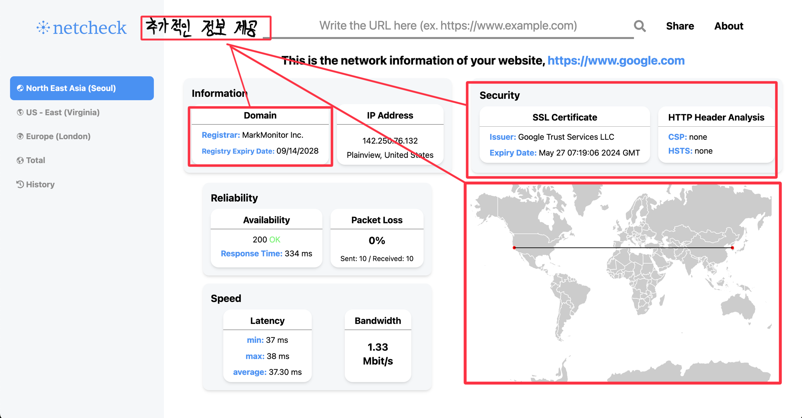
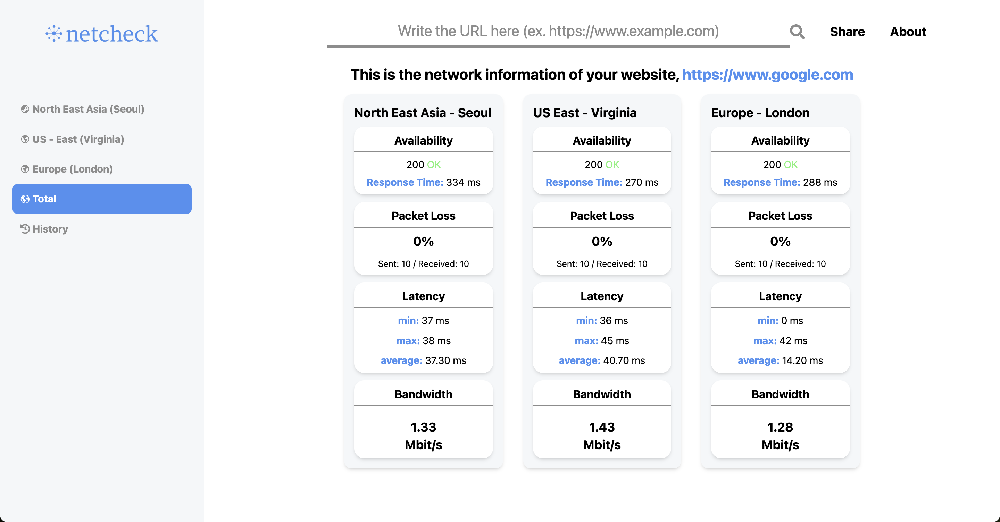
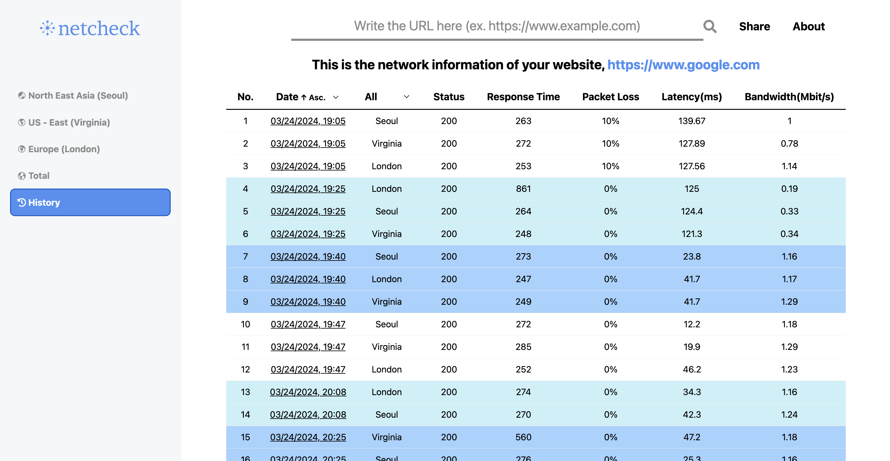
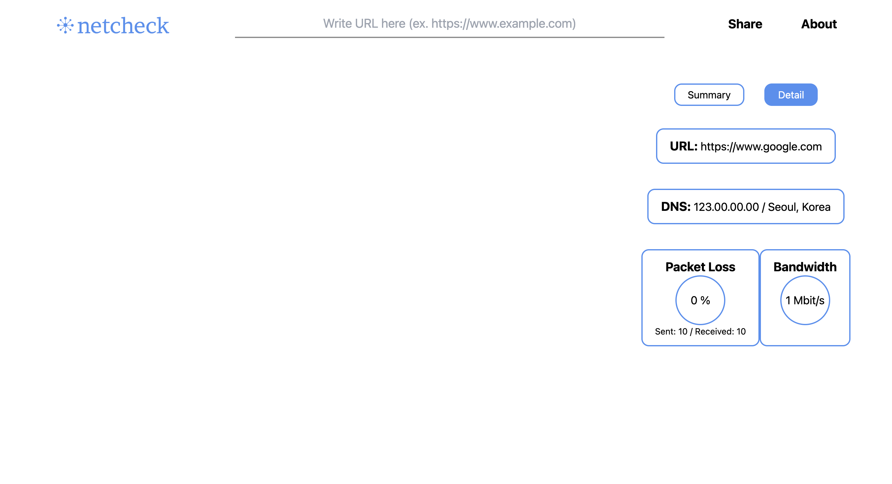
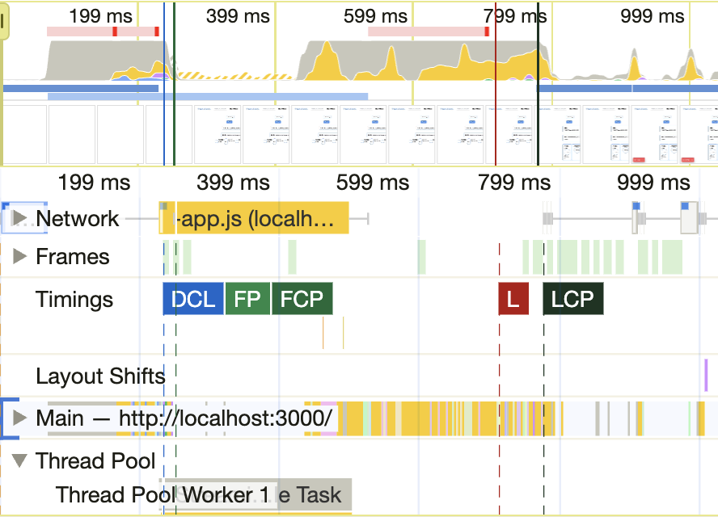

# netcheck

특정 웹사이트에 대한 네트워크 정보를 제공하는 웹 애플리케이션입니다. 사용자가 웹사이트의 URL을 입력하면 해당 웹사이트에 대한 다양한 네트워크 정보를 분석하여 제공합니다.

<a href="https://github.com/minho00123/netcheck-server">netcheck Server</a>

 

# 📌 Table of Contents

- [📌 Preview & Features](#📌-preview--features)
- [📌 Tech Stacks](#📌-tech-stacks)
  - [❓ Why React? (React vs. Next.js)](#❓-why-react-react-vs-nextjs)
- [📌 Challenges](#📌-challenges)
  - [📌 traceroute 직접 구현하기](#1-traceroute-직접-구현하기)
    - [네트워크 기초 용어 설명](#네트워크-기초-용어-설명)
    - [traceroute의 작동원리](#traceroute의-작동원리)
    - [코드 구현](#코드-구현)
  - [📌 ping 직접 구현하기](#2-ping-직접-구현하기)
    - [ping의 작동원리](#ping-작동원리)
    - [코드 구현](#ping-코드-구현)

 

# 📌 Preview & Features

### netcheck은 다음과 같은 기능을 제공합니다.

- Information
  - Domain: 도메인이 등록된 회사 정보와 만료일을 표시합니다.
  - IP Address: 웹사이트의 IP 주소와 지리적 위치를 표시합니다.
- Security
  - SSL Certificate: SSL 인증서의 만료일과 등록 기관 정보를 제공합니다.
  - HTTP Header Analysis: 웹사이트의 Content Security Policy 및 HTTP Strict Transport Security 등록 여부를 확인합니다.
- Reliability
  - Availability: 웹사이트의 HTTP 상태 코드와 응답 시간을 측정합니다.
  - Packet Loss: 네트워크 패킷 손실율을 측정합니다.
- Speed
  - Latency: 네트워크 지연율을 측정합니다.
  - Bandwidth: 웹사이트의 대역폭 사용량 정보를 제공합니다.
- Map
  - 사용자가 작성한 웹사이트까지의 경로를 시각화합니다.

- 다양한 지역(서울, 미국 버지니아, 영국 런던)에서의 정보를 한 눈에 비교할 수 있습니다.

- 사용자가 입력한 웹사이트의 이전 정보를 조회하고 비교할 수 있습니다.

- 다른 사용자와 이메일로 정보를 교환할 수 있습니다.

 

# 📌 Tech Stacks

## Frontend

- React
- Tailwind CSS
- Zustand
- Vite

## Backend

- Node.js
- Express
- Mongoose

## DB

- MongoDB

### ❓ Why React? (React vs. Next.js)

◉ 배경

- 프로젝트에는 사용자가 결과를 URL로 공유하는 기능이 포함되어 있습니다. 이떄 server-side에서 렌더링을 수행하면 페이지 로딩 속도를 개선할 수 있을 것으로 기대하며, Next.js의 도입을 고려하였습니다.

◉ 가정

- Next.js의 `getServerSideProps` 함수를 사용해 데이터를 사전에 불러온 후 렌더링하는 경우, client-side에서 렌더링을 수행하는 React보다 빠를 것이라 가정하였습니다.

◉ 테스트

- MongoDB Atlas에 저장된 데이터를 사용하여, 실제 프로젝트 환경을 모사하여 테스트를 진행하였습니다.
  

- 렌더링 속도 측정은 개발자 도구의 "Performance" 탭을 통해 이루어졌고, LCP(Largest Contentful Paint)를 기준으로 삼았습니다.
  - LCP는 가장 큰 콘텐츠(ex. 이미지, 비디오 블록, 텍스트 블록 등)가 렌더링되기까지 걸린 시간을 말합니다.
    

  
  

◉ 결과

- 총 5번의 속도를 측정한 결과는 다음과 같았습니다.

  |         | React   | Next.js |
  | ------- | ------- | ------- |
  | 1       | 791.68  | 704.84  |
  | 2       | 1010    | 844.95  |
  | 3       | 734.77  | 960.70  |
  | 4       | 688.57  | 866.48  |
  | 5       | 866.59  | 975.17  |
  | Average | 813.322 | 870.428 |

- SSR이 CSR보다 초기 렌더링이 빠르다는 일반적인 인식과 달리, 테스트 결과는 큰 차이를 보이지 않았습니다.

🧐 위와 같은 결과가 나온 이유는 무엇일까?

- SSR이 CSR보다 빠른 초기 렌더링을 가진다고 하지만, 왜 비슷한 결과를 보였는지는 다음과 같은 이유라고 생각해보았습니다.

1.  네트워크 및 장비 문제

- 테스트를 진행했던 당시의 네트워크 환경이 좋지 않거나, 테스트한 노트북 성능에 따라 속도가 달라질 수 있다.

2.  전송되는 데이터 크기

- SSR은 초기 로드 시에 전체 페이지에 콘텐츠를 모두 전송하지만, CSR은 필요한 데이터만을 로드하기 때문에 이러한 결과가 나올 수 있습니다.
- 리렌더링되는 경우에는 SSR이 빠를 수 있지만 프로젝트에서는 초기 렌더링 속도가 중요하다고 생각하기 때문에 React를 사용하는게 더 좋다는 결론을 내렸습니다.

 

# 📌 Challenges

## 1. `traceroute` 직접 구현하기

- `traceroute`는 두 인터넷 장치 간의 라우팅 경로를 표시하는 데 사용하는 컴퓨터 네트워크 진단 유틸리티 입니다. 이를 직접 구현하기 위해서는 작동원리에 대해 자세히 알아야 했습니다. 작동원리를 구현하기 전 알아야 할 네트워크 용어들이 있습니다.

### 네트워크 기초 용어 설명

1. UDP(User Datagram Protocol)

- UDP는 시간에 민감한 데이터를 전송하기 위해 사용되는 프로토콜입니다. 예를 들어 비디오 재생 또는 DNS 조회와 같은 곳에서 사용됩니다.
- UDP는 빠르게 데이터를 전송할 수 있다는 장점이 있지만 전달 중에 손실되면 다시 전송되지 않아 성능 저하가 생길 수 있습니다.

2. ICMP(Internet Control Message Protocol)

- ICMP는 라우터와 같은 네트워크 장치에서 네트워크 통신 문제를 진단하는 데 사용하는 네트워크 계층 프로토콜입니다.
- ICMP의 주요 목적은 오류 보고입니다. 두 장치가 인터넷을 통해 연결되면 ICMP는 데이터가 의도한 대상에 도달하지 못한 경우 오류를 생성합니다.
- ICMP의 보조 용도는 네트워크 진단을 수행하는 것입니다. 일반적으로 `traceroute`와 `ping`에서 사용됩니다.

3. 패킷(packet)

- 패킷은 네트워크를 통해 전송되는 데이터의 단위입니다. 네트워크에서 데이터를 전송할 때, 데이터는 여러 개의 작은 조각, 즉 패킷으로 나누어집니다. 각 패킷에는 데이터의 일부분과 함께 해당 데이터가 올바르게 전송되고 재조립될 수 있도록 돕는 제어 정보가 포함되어 있습니다.

4. TTL(Time-to-Live)

- TTL은 패킷이 네트워크 상에서 살아있을 수 있는 최대 홉(hop) 수를 지정합니다.
- 홉이란 한 라우터와 다른 라우터 간의 여정을 말합니다.
- 각 홉에서 라우터는 패킷의 TTL 값을 1 감소시킵니다. TTL 값이 0이 되면, 라우터는 더 이상 패킷을 전달하지 않고, "Time Exceeded" 메시지를 송신자에게 보내고 패킷을 페기합니다.

5. 라우터(Router)

- 라우터는 네트워크에서 데이터 패킷을 전송하는 장치로, 다른 네트워크 간에 정보를 전달하는 역할을 합니다.
- 라우터는 데이터 패킷이 출발지에서 목적지까지 가장 효율적인 경로를 찾아 이동할 수 있도록 돕습니다.

### `traceroute`의 작동원리

- `traceroute`는 첫 번째 패킷의 TTL을 1로 설정하고 목적지 주소로 UDP를 보냅니다. 이 패킷은 첫 번째 라우터에서 폐기되고, 해당 라우터는 ICMP를 이용하여 송신자에게 "Time Exceeded" 메시지를 보냅니다.
- 송신자는 이 메시지를 받고 첫 번째 라우터의 주소를 기록합니다.
- 다음 패킷은 TTL을 2로 설정하여 보냅니다. 이 패킷은 두 번째 라우터에서 폐기되고, 두 번째 라우터의 주소를 기록합니다.
- 이 과정을 목적지에 도달하거나 설정된 최대 홉 수에 도달할 때까지 반복합니다
- 각 단계에서 패킷의 왕복 시간을 측정하여 각 라우터까지의 지연 시간을 추정할 수 있습니다.

### 코드 구현

- 위에서 설명한 `traceroute` 작동 원리를 기반으로 `traceroute`를 직접 구현해보았습니다. 라이브러리를 최대한 사용하지 않으려고 했지만 Node.js는 저수준 네트워크 정보를 가져오지 못하기 때문에 일부 사용하게 되었습니다.
- 우선 UDP 데이터그램을 사용자가 입력한 주소로 보내기 위해 Node.js의 내장 모듈인 `dgram`을 이용하여 생성하였습니다.
  - `dgram` 모듈은 UDP 데이터그램 소켓을 통해 네트워크 통신을 수행할 수 있게 하는 내장 모듈입니다. 따라서 UDP 서버를 생성하고, UDP 클라이언트를 통해 메시지를 보내고 받을 수 있습니다.
- ICMP를 전달 받기 위해서 `raw-socket`이라는 외부 라이브러리를 사용하였습니다. 이 라이브러리는 Node.js에서 raw socket을 사용할 수 있게 해줍니다. Raw socket을 사용하면, 애플리케이션은 네트워크 레이어에서 직접 패킷을 보내고 받을 수 있습니다.
- 원리에서 처럼 TTL 수를 하나씩 늘려가면서 라우터에 대한 주소를 받아올 수 있었습니다. 그리고 무한히 TTL 수를 늘릴 수 없기 때문에 일반적으로 사용되는 최대 수인 20을 지정하였습니다.

## 2. `ping` 직접 구현하기

- `ping`은 네트워크 연결 상태와 속도를 진단하는 도구입니다. 주로 네트워크 문제를 진단하고, 특정 호스트가 네트워크 상에서 활성 상태인지 확인하는 데 사용됩니다.

### `ping` 작동원리

- `ping`은 ICMP(Internet Control Message Protocol)를 사용하여 네트워크 통신을 수행합니다. ICMP 에코 요청 메시지를 대상 호스트로 전송하고, 대상 호스트가 에코 응답 메시지를 반환합니다. 이러한 요청과 응답 메커니즘을 통해 네트워크의 연결 상태와 지연 시간을 측정할 수 있습니다.

### ping 코드 구현

- `ping`을 구현하기 위해서는 ICMP를 직접 생성하고 보내야 했습니다. 이를 위해서 `raw-socket` 라이브러리를 사용하였습니다.
- ICMP 에코 요청을 위한 패킷을 생성하기 위해서는 ICMP 헤더 버퍼를 만들어야 했습니다.
- ICMP 헤더는 ICMP 메시지를 구성하는 중요한 부분으로, 메시지의 유형, 코드, 체크섬, 기타 필요한 정보를 포함합니다.
- ICMP 헤더는 일반적으로 다음과 같은 구성 요소를 포함합니다:

  1. 유형(Type): 8비트 필드로, ICMP 메시지의 유형을 나타냅니다. 예를 들어, 에코 요청은 8, 에코 응답은 0의 값을 가집니다.
  2. 코드(Code): 8비트 필드로, 메시지 유형 내에서 더 세부적인 구분을 제공합니다. 대부분의 경우, 특히 에코 요청과 응답에서는 이 필드의 값이 0입니다.
  3. 체크섬(Checksum): 16비트 필드로, 헤더와 데이터의 오류 검출을 위한 값입니다. 수신자는 이 값을 사용하여 패킷의 무결성을 검증합니다. 체크섬은 송신자가 메시지를 전송하기 전에 계산되며, 수신자는 수신한 메시지의 체크섬을 다시 계산하여 두 값이 일치하는 지 확인합니다.
  4. 식별자(Identifier): 16비트 필드로, 보통 에코 요청을 보낸 프로세스의 ID를 식별하는 데 사용됩니다. 이 값은 에코 응답을 받았을 때 요청을 보낸 원래 프로세스를 식별하는 데 사용됩니다.
  5. 시퀀스 번호(Sequenc Number): 16비트 필드로, 동일한 식별자를 가진 여러 ICMP 메시지를 구분하기 위해 사용됩니다. 이 번호는 에코 요청을 보낼 때 마다 증가하며, 응답에서는 요청에서 받은 그대로의 값을 사용합니다.

- `raw-socket` 라이브러리를 이용하여 ICMP 프로토콜을 사용하는 소켓을 생성합니다.
- 각 요청에 대한 송신 시간을 기록하고, 응답 대기에 사용될 타임아웃 핸들러를 관리합니다.
- 주어진 횟수만큼 ping 요청을 반복하며, 각 요청에 대해 에코 응답을 기다립니다.
- 에코 응답이 도착하면 송신 시간과 수신 시간의 차이를 계산하여 지연 시간을 측정합니다.
- 모든 요청이 완료되면, 송신 횟수, 수신 횟수, 패킷 손실률, 각 요청의 지연 시간 배열을 포함하는 객체를 반환합니다.
