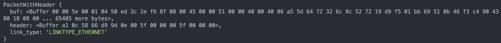
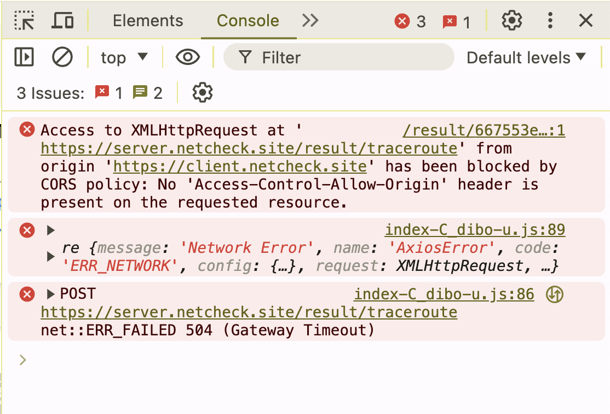

# netcheck

<p align="center">

</p>

<p align="center">
특정 웹사이트에 대한 네트워크 정보를 제공하는 웹 애플리케이션입니다. 사용자가 웹사이트의 URL을 입력하면 해당 웹사이트에 대한 다양한 네트워크 정보를 분석하여 제공합니다.
</p>

<p align="center">
<a href="https://github.com/minho00123/netcheck-server">netcheck Server Repository</a>
</p>

<br>

# 📌 Table of Contents

- [💡 시연 영상](#-시연-영상)
- [⚒️ 기술 스택](#️-기술-스택)
  - [❓ Why React? (React vs. Next.js)](#-why-react-react-vs-nextjs)
    - [◉ 사용자에게 더 나은 서비스를 제공할 수 있지 않을까?](#-사용자에게-더-나은-서비스를-제공할-수-있지-않을까)
    - [◉ 가정: SSR이 CSR보다 렌더링 속도가 빠를 것이다.](#-가정-ssr이-csr보다-렌더링-속도가-빠를-것이다)
    - [◉ React vs. Next.js](#-react-vs-nextjs)
    - [◉ SSR과 CSR의 렌더링 속도가 큰 차이를 보이지 않다.](#-ssr과-csr의-렌더링-속도가-큰-차이를-보이지-않다)
- [⚡️ 사전 준비](#️-사전-준비)
  - [◉ 왜 그 많은 주제 중에 네트워크?](#-왜-그-많은-주제-중에-네트워크)
  - [◉ 검증: Proof of Concept(PoC)](#-검증-proof-of-conceptpoc)
  - [◉ 느낀점: 기획의 중요성](#-느낀점-기획의-중요성)
- [🏃‍➡️ 과정](#️-과정)
  - [1. 사용자에게 어떤 정보를 제공할 것인가](#1-사용자에게-어떤-정보를-제공할-것인가)
    - [1-1. 네트워크 기본 개념을 공부하자!](#1-1-네크워크-기본-개념을-공부하자)
    - [1-2. 네트워크 개념을 정리하다.](#1-2-개념을-정리하다)
      - [UDP](#1-2-1-udpuser-datagram-protocol) (※ [TCP vs. UDP](#-tcp-vs-udp))
      - [ICMP](#1-2-2-icmpinternet-control-message-protocol)
      - [패킷](#1-2-3-패킷packet)
      - [TTL](#1-2-4-ttltime-to-live)
      - [라우터](#1-2-5-라우터router)
      - [대역폭](#1-2-6-대역폭bandwidth)
    - [1-3. "연결이 왜 안될까?"에 대한 정보를 제공하다.](#1-3-연결이-왜-안될까에-대한-정보를-제공하다)
    - [1-4. 수정: 연결이 왜 안되는지가 아닌 주어진 URL의 네트워크 정보를 제공하자!](#1-4-수정-연결이-왜-안되는지가-아닌-주어진-url의-네트워크-정보를-제공하자)
    - [1-5. 발전: 다양한 지리적 위치에서의 네트워크 정보를 제공하다.](#1-5-발전-다양한-지리적-위치에서의-네트워크-정보를-제공하다)
    - [1-6. 기능의 부족한 점과 더 개선할 방법은 없을까?](#1-6-기능의-부족한-점과-더-개선할-방법은-없을까)
  - [2. 다른 사용자에게 정보를 어떻게 제공할 것인가](#2-다른-사용자에게-정보를-어떻게-제공할-것인가)
    - [2-1. 이메일로 정보를 전달하자.](#2-1-이메일로-정보를-전달하자)
    - [2-2. `nodemailer`를 이용한 메일 공유](#2-2-nodemailer를-이용한-메일-공유)
    - [2-3. 결과 및 회고](#2-3-결과-및-회고)
- [🔥 도전](#-도전)
  - [네트워크 유틸리티를 직접 구현!?!](#-네트워크-유틸리티를-직접-구현)
  - [Node.js의 한계 - 저수준 네트워크 정보를 가져올 수 없다!](#-nodejs의-한계---저수준-네트워크-정보를-가져올-수-없다)
  - [구현 1: traceroute 직접 구현하기.](#-구현-1-traceroute-직접-구현하기)
    - [1-1. traceroute에 대해 공부하자.](#1-1-traceroute에-대해-공부하자)
    - [1-2. 일부 라이브러리를 사용하여 traceroute를 구현하다.](#1-2-일부-라이브러리를-사용한-traceroute-구현)
    - [1-3. 결과: 지리적 위치 정보를 추적하다.](#1-3-결과-지리적-위치-정보를-추적하다)
    - [1-4. 회고](#1-4-회고)
  - [구현 2: ping 직접 구현하기.](#구현-2-ping-직접-구현하기)
    - [2-1. ping에 대해 공부하자.](#2-1-ping에-대해-공부하자)
    - [2-2. ping 구현](#2-2-ping-구현)
    - [2-3. 결과: 패킷 손실율을 계산하다.](#2-3-결과-패킷-손실율을-계산하다)
    - [2-4. 회고](#2-4-회고)
- [❗️ 문제점](#️-문제점)
  - [CORS 에러 도대체 왜 생기는 건데?!?](#-cors-에러-도대체-왜-생기는-건데)
    - [CORS?](#-cors)
    - [그래서 문제는?](#-그래서-문제는)
    - [결론: 문제는 서버에!](#결론-문제는-서버에)
  - [raw-socket 문제점 해결하기](#raw-socket-문제점-해결)
    - [1. 루트(root) 권한으로 실행하기](#1-루트root-권한으로-실행하기)
    - [2. 라이브러리 사용하기(내 코드와 비교하기)](#2-라이브러리-사용하기내-코드와-비교하기)
  - [회고](#-회고)
- [✨ 개선](#-개선)
  - [더 많은 SSL/TLS 정보 가져오기](#-더-많은-ssltls-정보-가져오기)
    - [1. https 모듈 사용](#1-https-모듈-사용)
    - [2. OpenSSL 명령어 사용](#2-openssl-명령어-사용)
    - [3. API 서비스 사용](#3-api-서비스-사용)
  - [네트워크 정보 추가하기](#-네트워크-정보-추가하기)
    <br>

# 💡 시연 영상


# ⚒️ 기술 스택

## Frontend


## Backend


## DB


## ❓ Why React? (React vs. Next.js)

### ◉ 사용자에게 더 나은 서비스를 제공할 수 있지 않을까?

- 사용자에게 보다 나은 경험을 제공하기 위해 server-side와 client-side 렌더링을 비교해보았습니다. Server-side 렌더링(SSR)은 서버에서 미리 HTML 페이지를 그려 브라우저로 보내기 때문에 client-side 렌더링(CSR)보다 더 빠르게 페이지를 렌더링할 수 있습니다. 이를 바탕으로 실제 프로젝트에서 얼마나 차이를 보이는 지 궁금하여 테스트를 진행해보았습니다. 동일한 페이지를 렌더링하는 데 있어서 Next.js로 server-side를, React로는 client-side를 구현하였습니다.

### ◉ 가정: SSR이 CSR보다 렌더링 속도가 빠를 것이다.

- Next.js의 `getServerSideProps` 함수를 사용하여 데이터를 사전에 불러와 렌더링하는 경우, client-side에서 렌더링을 수행하는 React보다 빠를 것이라 가정하였습니다.

### ◉ React vs. Next.js

- MongoDB Atlas에 데이터를 저장해놓고, 이 데이터를 가져와 실제 프로젝트 환경을 모사하여 테스트를 진행하였습니다.
  <p align="center">

</p>

- 렌더링 속도 측정은 개발자 도구의 "Performance" 탭을 통해 이루어졌고, LCP(Largest Contentful Paint)를 기준으로 삼았습니다. 그 이유는 LCP가 끝나면 렌더링이 완료된 것을 확인할 수 있었기 때문입니다.
  - LCP는 가장 큰 콘텐츠(ex. 이미지, 비디오 블록, 텍스트 블록 등)가 렌더링되기까지 걸린 시간을 말합니다.
    <p align="center">
  
  </p>

### ◉ SSR과 CSR의 렌더링 속도가 큰 차이를 보이지 않다.

- 총 5번의 속도를 측정한 결과는 다음과 같았습니다.

  |         | React   | Next.js |
  | ------- | ------- | ------- |
  | 1       | 791.68  | 704.84  |
  | 2       | 1010    | 844.95  |
  | 3       | 734.77  | 960.70  |
  | 4       | 688.57  | 866.48  |
  | 5       | 866.59  | 975.17  |
  | Average | 813.322 | 870.428 |

- SSR이 CSR보다 초기 렌더링이 빠르다는 일반적인 인식과 달리, 테스트 결과는 큰 차이를 보이지 않았습니다.

🧐 위와 같은 결과가 나온 이유는 무엇일까?

- SSR이 CSR보다 빠른 초기 렌더링을 가진다고 하지만, 왜 비슷한 결과를 보였는지는 다음과 같은 이유라고 생각해보았습니다.

1. 네트워크 및 장비 문제

- 테스트를 진행했던 당시의 네트워크 환경이 좋지 않거나, 테스트한 노트북 성능에 따라 속도가 달라질 수 있습니다.

2. 전송되는 데이터 크기

- SSR은 초기 로드 시에 전체 페이지에 콘텐츠를 모두 전송하지만, CSR은 필요한 데이터만을 로드하기 때문에 이러한 결과가 나올 수 있습니다.
  <br>
  <br>
  ∴ 리렌더링되는 경우에는 SSR이 빠를 수 있지만 프로젝트에서는 초기 렌더링 속도가 중요하다고 생각하기 때문에 React를 사용하는게 더 좋다는 결론을 내렸습니다.

<br>

# ⚡️ 사전 준비

## ◉ 왜 그 많은 주제 중에 네트워크?

- 개인 프로젝트를 만들기 위해 다양한 아이디어를 생각해보았습니다. Rust 플레이그라운드를 만들어 웹페이지에서 실행해보는 프로그램을 만들어 보고 싶었으나, 제한된 시간 안에 완성해야 했기에 Rust에 대한 기본 지식이 없는 저는 다른 아이디어를 생각해야 했습니다. 하나의 데이터로 여러 종류의 계획서로 변환해주는 프로젝트도 생각해보았지만 혼자서 구현하기에는 주제가 너무 광범위하기에 제외하였습니다.
- 그러던 중에 패킷 분석 프로그램인 Wireshark를 접하게 되었습니다. Wireshark는 오픈 소스 프로그램으로, 네트워크의 문제를 분석할 때 주로 사용됩니다. 이 프로그램을 사용하기에는 진입 장벽이 있었습니다. 사용하는 방법을 공부해야 했고, 패킷을 분석하는 방법 또한 알아야 했습니다. 사용자에게 쉽게 네트워크 정보를 알려줄 방법이 있으면 좋겠다는 생각을 하여 네트워크 관련 주제를 정하게 되었습니다.

## ◉ 검증: Proof of Concept(PoC)

- 우선 사용자에게 무엇을 제공할 지 정하였습니다. "왜 특정 웹사이트에 접속이 불가능 할까?"라는 주제를 생각하며 PoC를 진행하였습니다. 해당 주제에 대해서는 네트워크 연결 문제, 웹사이트 서버 문제, DNS 문제, URL 입력 오류로 크게 4가지 소주제로 나누었습니다.

1. 네트워크 연결 문제

- 4가지 소주제 중에 가장 중요한 주제라고 생각했습니다. 사용자가 가장 궁금해하는 주제이며 이번 프로젝트 주제와 가장 적합한 주제라고 생각했습니다.
- 네트워크 연결 문제는 라우터 문제, ISP 문제, 로컬 네트워크 문제, 연결 지연, 패킷 손실률, 비정상적인 트래픽 패턴 등이 있을 것이라고 생각하였습니다. 각각의 문제를 어떻게 구현할 것인지를 검증해 본 결과, ISP 경우에는 접근할 수 있는 권한이 없었기에 진행할 수 없었으며 로컬 네트워크 문제는 범위가 너무 넓어 구현하지 못할 것으로 판단하였습니다.
- 네트워크 트래픽 문제는 `pcap`을 사용하여 캡쳐하고 분석할 수 있었습니다. 아래는 `pcap`을 이용하여 코드를 작성하고 네트워크 트래픽 정보를 가져온 결과입니다.

```js
// pcap을 사용한 네트워크 트래픽 정보 가져오기
const pcap = require("pcap");

const pcap_session = pcap.createSession("en0");

pcap_session.on("packet", function (raw_packet) {
  console.log(raw_packet);
});
```

- 결과
  

2. 웹사이트 서버 문제

- 웹사이트의 서버 문제는 서버가 다운되거가 트래픽이 과부하되어 생성될 수 있습니다. 서버 다운은 Node.js에서 제공하는 모듈인 `http`를 이용하여 서버에 요청을 보내 응답을 확인하면 결과를 알 수 있었습니다. 트래픽 과부화는 라우터 문제와 같이 `pcap`을 이용하여 정보를 가져올 수 있었습니다.
- 다음은 `http` 모듈을 사용한 코드와 결과입니다.

```js
//http를 이용한 서버 문제 확인하기
const http = require("http");

http
  .get("http://www.google.com", res => {
    console.log(`Status Code: ${res.statusCode}`);
    if (res.statusCode !== 200) {
      console.log("Status Error");
    }
  })
  .on("error", e => {
    console.error(e.message);
  });
```

```shell
# 위 http 코드 결과
Status Code: 200
```

3. DNS 문제

- DNS에서 도메인 주소를 IP 주소로 바뀌지 못했을 경우에 네트워크 문제가 생길 수 있습니다. 이 문제는 `dns` 라이브러리를 사용하여 오류가 발생 여부를 확인하여 정보를 가져올 수 있습니다. `dns` 라이브러리는 지정된 도메인의 정보를 알아올 수 있는 모듈입니다. 지정된 도메인의 IP 주소를 알려주는데, 만약 이 주소를 가져오지 못하면 DNS에 문제가 있는 것이라 가정하였습니다.

```js
// dns를 이용한 DNS 오류 발생 여부 확인하기
const dns = require("dns");

dns.lookup("google.com", (err, address) => {
  if (err) {
    console.error(err.message);
  } else {
    console.log("IP Address:", address);
  }
});
```

```shell
# 위 dns 코드 결과
IP Address: 142.251.222.46
```

4. URL 입력 문제

- URL 입력 문제는 정규 표현식으로 손쉽게 오류를 파악할 수 있습니다.면서 어떠한 경로를 통해 우리에게 전달되는 지 궁금하였습니다. 이러한 궁금증을 해결하고자 네트워크 정보를 제공하는 웹사이트를 만들기로 결정하였습니다. 네트워크 관련 주제는 저의 네트워크 지식을 향상시키기에 좋은 경험이라고 생각했고, 사용자에게도 평소의 궁금증을 해소시켜 줄 좋은 기회라고 생각하였습니다.

  - [아이디어 노트 노션 링크](https://dune-hammer-c89.notion.site/58dc7828f4274c9a80130fe5aa271351?pvs=4)

<br>
<br>
- 위의 검증 과정을 통해 해당 프로젝트에서 사용하는 기능을 구현할 수 있다는 확신을 가지게 되었습니다.

## ◉ 느낀점: 기획의 중요성

- 프로젝트를 직접 기획하고 구현하는 것은 처음이였습니다. 이 과정에서 기획의 중요성을 느끼게 되었습니다. 기획이 탄탄해야 나중에 흔들리지 않고, 그리고 수정이 적다는 것을 깨달았습니다. 기획을 제대로 세웠다고 생각하였지만 나중에 가서는 결국 수정을 할 수 밖에 없었습니다. 처음부터 생각을 깊게 하여 사용자가 무엇을 원하는 지를 정한 다음에 어떠한 방법을 통해 구현할 지를 충분히 생각하는 과정이 굉장히 중요하다고 생각합니다. 이렇게 해야지만 프로젝트를 보다 쉽고 빠르게 진행할 수 있다는 생각이 들었습니다. 탄탄한 기획은 기반이 단단하기에 흔들림 없이 진행할 수 있다고 생각합니다.

# 🏃‍➡️ 과정

## 1. 사용자에게 어떤 정보를 제공할 것인가?

### 1-1. 네크워크 기본 개념을 공부하자.

- 사용자에게 필요한 정보를 제공하기 위해서는 우선 저의 네트워크 지식을 향상시켜야 했습니다. 공부를 진행하면서 무엇이 필요한 내용일지를 곰곰히 생각해보았습니다.

### 1-2. 개념을 정리하다.

- 네트워크 기본 개념들을 다음과 같이 정리하였습니다:

  - #### 1-2-1. UDP(User Datagram Protocol)

    - UDP는 보안과 신뢰성보다 전송 속도와 효율성이 더 중요한 경우 데이터를 전송하기 위해 IP와 함께 오래 사용된 프로토콜이다. 특히 비디오 재생 또는 DNS 조회와 같이 시간에 민감한 전송을 위해 인터넷을 통해 사용된다. 데이터가 전송되기 전에는 공식적으로 연결이 설정되지 않으므로 통신 속도가 빨라진다. 따라서 데이터를 아주 빠르게 전송할 수 있지만, 전송 중에 패킷이 손실되어 DDoS 공격의 형태로 악용될 수 있다.
    - UDP는 오류 확인 및 수정이 필요하지 않거나 애플리케이션에서 수행되는 목적에 적합하다. 특히 시간에 민감한 애플리케이션은 UDP를 사용하는 경우가 많다. 실시간 시스템(ex, 온라인 게임)에서 이상적인 프로토콜이다. 실시간 시스템에서 UDP는 옵션이 아닐 수 있는 재전송으로 인해 지연된 패킷을 기다리는 것보다, 패킷 삭제가 더 바람직하기 때문이다. DNS 서버는 빠르고 효율적이기도 해야 하므로 UDP를 통해서도 작동한다.

  - ##### ※ TCP vs. UDP

    - TCP는 안정적인 데이터 전달을 보장하는 전송 계층 프로토콜이다.
    - TCP를 연결하는 것은 다른 회사 사무실에 있는 누군가에게 전화를 거는 것과 비슷하다. 먼저 회사의 전화번호를 누른다. 이렇게 하면 그 회사로 연결된다. 그 다음에엔 전화를 걸고자 하는 상대방이 쓰는 번호를 누른다.
    - TCP는 다음을 제공한다.
      - 오류 없는 데이터 전송
      - 순서에 맞는 전달 (데이터는 언제나 보낸 순서대로 도착한다)
      - 조각나지 않는 데이터 스트림 (언제든 어떤 크기로든 보낼 수 있다)
    - TCP는 handshake를 통해 연결을 설정한다. 이 handshake가 완료된 후에만 실제로 데이터 패킷이 한 컴퓨터에서 다른 컴퓨터로 전송된다.
    - TCP는 데이터 패킷이 수신되어야 하는 순서를 나타내고 패킷이 의도한 대로 도착하는지 확인한다. 패킷이 도착하지 않는 경우 TCP를 다시 보내야 한다. UDP에는 이러한 기능이 없다. 따라서 UDP는 handshake가 필요없고, 데이터가 제대로 도착하는지 확인하지 않기 떄문에 TCP보다 훨씬 빠르게 데이터를 전송할 수 있다. 따라서 UDP는 TCP보다 빠르지만, 안정성이 떨어진다.

  - 참고: [MDN](https://developer.mozilla.org/ko/docs/Glossary/UDP), [Cloudflare](https://www.cloudflare.com/ko-kr/learning/ddos/glossary/user-datagram-protocol-udp/)

  - #### 1-2-2. ICMP(Internet Control Message Protocol)

    - ICMP는 네트워크 장치에서 네트워크 통신 문제를 진단하는 데 사용하는 네트워크 계층 프로토콜이다. ICMP는 주로 데이터가 의도한 대상에 적시에 도달하는지 여부를 확인하는 데 사용된다.
      - Ex. 메시지가 너무 길거나 데이터 패킷이 순서에 맞지 않게 도착하여 수신자가 메시지를 조합하지 못할 수 있다. 이러한 경우 수신자는 ICMP를 사용하여 발신자에게 오류 메시지를 알리고 메시지 재전송을 요청한다.
    - ICMP의 주요 목적은 오류 보고다. 두 장치가 인터넷을 통해 연결되면 ICMP는 데이터가 의도한 대상에 도달하지 못한 경우 전송하는 장치와 공유할 오류를 생성한다.
      - Ex. 데이터 패킷이 라우터에 비해 너무 큰 경우 라우터에서는 패킷을 삭제하고 ICMP 메시지를 데이터의 원래 소스로 돌려보내다.
    - ICMP의 보조 용도는 네트워크 진단을 수행하는 것이다. 일반적으로 사용되는 터미널 유틸리티 `traceroute` 와 `ping`은 모두 ICMP를 사용하여 작동한다.
    - ICMP은 TCP 또는 UDP와 같은 전송 계층 프로토콜과 연결되지 않는다. 따라서 ICMP가 연결이 없는 프로토콜이 되므로 한 장치에서 ICMP 메시지를 보내기 전에 다른 장치와의 연결을 수행할 필요가 없다. ICMP는 일반적으로 TCP/IP 또는 UDP 같은 다른 네트워크 프로토콜과 함께 작동한다.

    - 참고: [Cloudflare](https://www.cloudflare.com/ko-kr/learning/ddos/glossary/internet-control-message-protocol-icmp/), [AWS](https://aws.amazon.com/ko/what-is/icmp/)

  - #### 1-2-3. 패킷(packet)

    - 패킷은 네트워크를 통해 전송되는 데이터의 단위이다. 네트워크에서 데이터를 전송할 때, 데이터는 여러 개의 작은 조각, 즉 패킷으로 나누어진다. 각 패킷에는 데이터의 일부분과 함께 해당 데이터가 올바르게 전송되고 재조립될 수 있도록 돕는 제어 정보가 포함되어 있다.

    - 참고: [Cloudflare](https://www.cloudflare.com/ko-kr/learning/network-layer/what-is-a-packet/)

  - #### 1-2-4. TTL(Time-to-Live)

    - TTL은 패킷이 네트워크 상에서 살아있을 수 있는 최대 홉(hop) 수를 지정한다. 홉이란 한 라우터와 다른 라우터 간의 여정을 말한다. 각 홉에서 라우터는 패킷의 TTL 값을 1 감소시킨다. TTL 값이 0이 되면 라우터는 더 이상 패킷을 전달하지 않고, "Time Exceeded" 메시지를 송신자에게 보내고 패킷을 페기한다.

    - 참고: [Cloudflare](https://www.cloudflare.com/ko-kr/learning/cdn/glossary/time-to-live-ttl/)

  - #### 1-2-5. 라우터(Router)

    - 라우터는 네트워크에서 데이터 패킷을 전송하는 장치로, 다른 네트워크 간에 정보를 전달하는 역할을 한다. 데이터 패킷이 출발지에서 목적지까지 가장 효율적인 경로를 찾아 이동할 수 있도록 돕는다.

    - 참고: [Cloudflare](https://www.cloudflare.com/ko-kr/learning/network-layer/what-is-a-router/)

  - #### 1-2-6. 대역폭(Bandwidth)

    - 네트워크에서의 대역폭은 컴퓨터 네트워크나 인터넷 연결을 통해 한 지점에서 다른 지점으로 최대 데이터 양을 전송하는 용량이다. 데이터 연결의 대역폭이 클수록 한 번에 주고 받을 수 있는 데이터도 많아진다. 속도는 데이터가 전송될 수 있는 속도를 말하는 반면, 대역폭의 정의는 그 속도에 대한 용량이다. 물을 예를 들어 설명하면 속도는 물이 얼마나 빨리 파이프를 통과하는지, 대역폭은 파이프의 직경을 의미한다.

    - 참고: [정보통신용어사전](https://terms.tta.or.kr/dictionary/searchList.do?searchContent=conts01&searchRange=all&listCount=10&listPage=1&orderby=KOR_SUBJECT&reFlag=N&orderbyOption=TRUE&conts01WhereSet=&firstWordVal=&firstWord=N&word_seq=&div_big_cd_in=51&div_big_cd=&searchTerm=%EB%8C%80%EC%97%AD%ED%8F%AD&searchCate=field), [MDN](https://developer.mozilla.org/ko/docs/Glossary/Bandwidth)

### 1-3. "연결이 왜 안될까?"에 대한 정보를 제공하다.

- 공부하는 과정에서 사용자가 가장 필요로하는 정보는 네트워크 연결 여부라고 생각했습니다. 만약 특정 URL이 제대로 동작하지 않으면 왜 연결이 안되는 지를 가장 궁금해할 것입니다. 이 궁금증을 충족시키기 위해 연결 시간, 패킷의 손실 여부, 지연율, 대역폭의 정보를 제공하였습니다.
- 연결 시간과 패킷의 손실 여부, 그리고 지연율은 `ping`을 사용하여 정보를 가져왔습니다. `ping`은 네트워크 연결 상태와 속도를 진단하는 도구 입니다. 이 네트워크 유틸리티를 사용하여 사용자가 입력한 URL까지의 패킷이 도달하는 시간을 측정하여 연결 시간을 계산하였습니다. 패킷 손실 여부와 지연율은 `ping` 유틸리티에서 제공하는 정보를 사용하였습니다.

### 1-4. 수정: 연결이 왜 안되는지가 아닌 주어진 URL의 네트워크 정보를 제공하자!

- 모든 정보를 제공하였을 때 드는 생각은 이게 정말로 사용자에게 필요한 정보인가라는 것이었습니다. 연결이 왜 안되는 지를 알고 싶기도 하겠지만 더 많은 정보를 제공하는 웹사이트를 만들고 싶었습니다. 따라서 기존의 네트워크에 문제가 있는 지를 알려주는 것이 아닌 해당 URL에 대한 네트워크 정보를 제공하는 방향으로 나아가게 되었습니다.
- 추가적인 정보로 사용자가 만든 웹사이트의 네트워크 정보를 확인하고 싶을 때의 상황을 생각하였습니다. 도메인이 등록된 회사 정보와 만료일, IP 주소와 지리적 위치, SSL, CSP, HSTS와 같은 보안 관련 정보 등록 여부, 그리고 웹사이트가 어떤 경로로 클라이언트에서 서버로 전송되는 지를 지도로 나타내었습니다. 도메인 정보와 IP 정보는 Node.js가 자체적으로 제공하는 라이브러리인 `dns`를 이용하여 정보를 가져올 수 있었습니다. 보안 정보는 Node.js의 "https"를 이용하여 가져올 수 있었습니다. 마지막으로 서버의 경로는 `traceroute` 네트워크 유틸리티를 이용하여 가져올 수 있었습니다.
- 처음 방향과는 다른 방향으로 나아가게 되었지만 결과적으로는 사용자에게 더 많은 정보를 제공할 수 있었습니다.


### 1-5. 발전: 다양한 지리적 위치에서의 네트워크 정보를 제공하다.

- 모든 정보를 제공한 후에 추가적인 아이디어를 생각하게 되었습니다. 현재 위치 뿐만 아니라 다양한 대륙에서 해당 URL로의 네트워크 정보는 어떻게 달라지는 지 정보를 제공하고 싶었습니다. 이러한 결과를 제공하기 위해서는 AWS에서 제공하는 서버 중에서 대한민국 서울, 미국 버지니아, 영국 런던을 선택하였습니다. 이렇게 3가지 도시를 선택한 이유는 우선 여러 대륙인 아시아, 유럽, 북아메리카를 선택할 수 있다는 점에서 선택하였고, 이 3가지 도시가 지리적으로 보았을 때 동등한 위치에 있었기 때문입니다.


### 1-6. 기능의 부족한 점과 더 개선할 방법은 없을까?

- 모든 기능을 만든 후에는 부족한 점은 없는 지, 그리고 더 발전시킬 것은 없는 지를 생각해보았습니다. 다양한 정보를 제공하긴 하지만 정말로 이 정보들이 사용자가 원하는 것인지는 의문이 있었습니다. 따라서 직접 배포를 해보고 사용자의 반응을 확인하는 것이 좋다는 생각이 들었습니다. 따라서 추후에 홈페이지에서 질문 페이지를 만들어 사용자의 의견에 귀를 기울여 정보를 제공하고자 합니다.

## 2. 사용자가 다른 사용자에게 정보를 어떻게 공유할 수 있을까??

### 2-1. 이메일로 정보를 전달하자.

- 사용자에게 어떠한 정보를 제공할까를 생각한 후에 어떠한 기능이 더 필요할 지를 생각해보았습니다. 그 중 다른 사람에게 해당 정보를 공유하면 좋겠다는 생각이 들었습니다. 사용자가 만든 사이트에 대한 문제점 또는 네트워크 정보를 다른 사람에게 공유하여 보다 편리하게 정보를 교환하도록 하였습니다.

### 2-2. `nodemailer`를 이용한 메일 공유

- 어떠한 방식으로 전달할까를 생각하던 중에 메일로 공유를 하면 좋겠다는 생각이 들었습니다. 그 이유는 보안상에 장점이 있고, 보관 및 검색에 용이하기 때문입니다. 이메일을 보내기 위해서 생각한 방식은 Node.js의 모듈인 `nodemailer`를 사용하는 것이었습니다. `nodemailer`는 Node.js에서 손쉽게 이메일을 보내주는 모듈입니다. 여러 가지 옵션을 제공하며, SMTP나 OAuth2와 같은 인증 방식도 지원합니다.
  - SMTP는 인터넷에서 이메일을 보내기 위해 사용하는 프로토콜입니다. SMTP는 이메일을 보내는 서버에서 이메일을 받는 서버로 메시지를 전달하는 역할을 합니다.. SMTP는 보내는 메일 서버에서 메시지를 받고, 메시지의 수신자가 자신의 도메인에 속해 있으면 메시지를 로컬 사용자에게 전달하게 됩니다. 수신자가 자신의 도메인에 속하지 않는 경우, SMTP는 메시지를 더 가까운 SMTP 서버로 전달합니다.
  - OAuth2는 인터넷 사용자가 애플리케이션에 계정 데이터를 제공하지 않고, 특정 데이터에 대한 접근을 공유할 수 있게 하는 인증 프로토콜입니다. 예를 들어, 사용자가 Google 계정 정보를 직접 제공하지 않고도 Google에서 제공하는 서비스(Gmail, Google Calendar 등)에 대한 데이터를 볼 수 있는 애플리케이션이 존재하는데, 이 애플리케이션은 OAuth를 통해 Google에 인증을 요청하고, Google은 애플리케이션에 토큰을 제공합니다. 이 토큰은 애플리케이션이 사용자를 대신하여 특정 작업을 수행하는 데 필요한 권한을 제공하고, 이렇게 하면 애플리케이션은 사용자의 Google 계정 자격 증명을 직접 알지 못하고도 사용자가 허용한 작업을 수행할 수 있게 됩니다.
- Node.js에서 이메일을 보내주는 모듈은 `SendGrid`, `EmailJS`, `nodemailer` 등과 같이 여러가지가 있습니다. 이 중 `nodemailer`를 선택한 이유는 다음과 같습니다:
  - `nodemailer`는 오픈 소스 라이브러리 입니다. 다른 두 모듈은 일부 제한된 상태에서 무료로 제공합니다. 따라서 제한없이 무료로 사용할 수 있는 `nodemailer`를 사용하였습니다.
  - `nodemailer`는 개발자가 직접 이메일 구성요소를 제작하여 사용자에게 이메일 템플릿을 제공할 수 있습니다.
  - `nodemailer`는 Node.js 전용 라이브러리이므로 모든 Node.js 애플리케이션에 쉽게 통합될 수 있습니다. 또한 다른 JavaScript 환경에서도 사용할 수 있습니다.
  - `nodemailer`는 이메일 전송을 위해 SMTP를 사용합니다. 이를 통해 개발자는 이메일 전송 프로세스를 더 효과적으로 제어할 수 있으며 다양한 이메일 서버와 통합할 수 있습니다.

### 2-3. 결과 및 회고

- 사용자가 자신이 공유해주고 싶은 사람에게 이메일을 보내면 해당 정보를 보내도록 하였습니다. 이메일을 사용한 이유는 네트워크 정보를 확인하기 위해서는 모바일이 아닌 웹사이트를 사용할 것이라 생각했기 때문입니다. 자신의 웹사이트가 제대로 작동하는지 확인하기 위해서는 제한된 화면에서 사용하기에는 많은 제약이 있을 것이라 생각되었습니다. 그렇지만 현재 많은 사람들이 모바일 환경에서 많은 정보를 가져오기 때문에 추후에 모바일 환경에 맞춘 정보 배열을 확립하여 제공할 예정입니다.


# 🔥 도전

## ◉ 네트워크 유틸리티를 직접 구현?!?

- 네트워크 유틸리티를 사용하여 패킷 손실, 그리고 지리적 위치 정보를 가져오던 중에 실제로 이 유틸리티를 구현해보면 네트워크의 개념과 원리를 더 깊이 알 수 있을 것이라 생각하였습니다. 따라서 두 인터넷 연결 간의 경로를 알기 위해 사용했던 `traceroute`와 네트워크 연결 상태와 속도 정보를 가져오기 위한 `ping` 유틸리티를 직접 구현해보기로 하였습니다.

## ◉ Node.js의 한계 - 저수준 네트워크 정보를 가져올 수 없다!

- `traceroute`와 `ping`을 라이브러리 없이 구현해보려고 노력하였지만 예상치 못한 한계점을 맞이하였습니다. 이미 구현된 라이브러리를 참고하던 중에 C++을 이용한 코드들이 보였습니다. 왜 JavaScript를 사용하지 않고 다른 프로그래밍 언어를 사용하였는 지 찾아본 결과, JavaScript로는 저수준의 네트워크 정보를 가져올 수 없다는 것을 알게 되었습니다. 이에 대한 한계점 때문에 일부 라이브러리를 사용하게 되었습니다. UDP 데이터 그램 소켓을 통해 네트워크 통신을 수행할 수 있게 해주는 모듈인 `dgram`과 ICMP를 전달 받기 위해서 `raw-socket` 라이브러리를 사용하였습니다.

## ◉ 구현 1: `traceroute` 직접 구현하기

### 1-1. `traceroute`에 대해 공부하자.

- `traceroute`는 두 인터넷 장치 간의 라우팅 경로를 표시하는 데 사용하는 컴퓨터 네트워크 진단 유틸리티 입니다. 이를 직접 구현하기 위해서는 작동원리에 대해 자세히 공부하였습니다. 작동원리는 다음과 같습니다:

  - `traceroute`는 첫 번째 패킷의 TTL을 1로 설정하고 목적지 주소로 UDP를 보냅니다. 이 패킷은 첫 번째 라우터에서 폐기되고, 해당 라우터는 ICMP를 이용하여 송신자에게 "Time Exceeded" 메시지를 보냅니다.
  - 송신자는 이 메시지를 받고 첫 번째 라우터의 주소를 기록합니다.
  - 다음 패킷은 TTL을 2로 설정하여 보냅니다. 이 패킷은 두 번째 라우터에서 폐기되고, 두 번째 라우터의 주소를 기록합니다.
  - 이 과정을 목적지에 도달하거나 설정된 최대 홉 수에 도달할 때까지 반복합니다
  - 각 단계에서 패킷의 왕복 시간을 측정하여 각 라우터까지의 지연 시간을 추정할 수 있습니다.

### 1-2. 일부 라이브러리를 사용한 `traceroute` 구현

- 위에서 설명한 `traceroute` 작동 원리를 기반으로 `traceroute`를 직접 구현해보았습니다.
  - 우선 UDP 데이터그램을 사용자가 입력한 주소로 보내기 위해 Node.js의 내장 모듈인 `dgram`을 이용하여 생성하였습니다.
    - `dgram` 모듈은 UDP 데이터그램 소켓을 통해 네트워크 통신을 수행할 수 있게 하는 내장 모듈입니다. 따라서 UDP 서버를 생성하고, UDP 클라이언트를 통해 메시지를 보내고 받을 수 있습니다.
  - ICMP를 전달 받기 위해서 `raw-socket`이라는 외부 라이브러리를 사용하였습니다. 이 라이브러리는 Node.js에서 raw socket을 사용할 수 있게 해줍니다. Raw socket을 사용하면, 애플리케이션은 네트워크 레이어에서 직접 패킷을 보내고 받을 수 있습니다.
  - 원리에서 처럼 TTL 수를 하나씩 늘려가면서 라우터에 대한 주소를 받아올 수 있었습니다. 그리고 무한히 TTL 수를 늘릴 수 없기 때문에 일반적으로 사용되는 최대 수인 20을 지정하였습니다. 20으로 설정하는 이유는 다음과 같습니다:
    - 일반적인 인터넷 경로에서는 20 홉을 넘는 경우가 드뭅니다. 대부분의 인터넷 트래픽은 10~15 홉 이내에서 목적지에 도달합니다. 따라서 TTL 값을 20으로 설정하면 대부분의 경우 충분히 경로를 추적할 수 있습니다.
    - TTL 값을 너무 높게 설정하면 불필요하게 많은 홉을 추적하게 되어 네트워크와 시스템 리소스를 낭비하게 됩니다. 반대로 TTL 값을 너무 낮게 설정하면 목적지에 도달하기 전에 TTL이 소진되어 경로를 완전히 추적할 수 없습니다. TTL 값 20은 이러한 균형을 잘 맞추어 효율적인 경로 추적을 가능하게 합니다.
    - TTL 값이 너무 높으면 네트워크 문제를 디버깅하는 동안 과도한 패킷 생성으로 인해 네트워크에 추가적인 부하를 줄 수 있습니다. 20 정도의 TTL 값은 충분한 정보를 제공하면서도 네트워크에 과도한 부담을 주지 않는 적정선입니다.

### 1-3. 결과: 지리적 위치 정보를 추적하다.

- 주어진 URL에 대해 UDP 패킷을 보내기 위해 `dgram` 소켓을 사용하고, ICMP 응답을 듣기 위해 `raw-socket`을 사용합니다. TTL 값을 1부터 시작하여 증가시키며 패킷을 보냅니다. 각 홉에서 응답 시간을 기록하고, 목표 IP 주소에 도달하거나 최대 홉 수에 도달하면 결과를 반환합니다. 결과적으로 주어진 URL에 대해 traceroute 작업을 수행하여 각 홉의 IP 주소와 응답 시간을 캡처합니다. UDP를 사용하여 패킷을 보내고 ICMP를 사용하여 응답을 수신함으로써 사용자가 작성한 URL까지의 지리적 위치 정보를 추적할 수 있었습니다.

### 1-4. 회고

- `traceroute` 코드에는 사용자 경험을 헤치는 문제점이 있었습니다. TTL 값을 20으로 설정하였지만 20까지 가는 경우가 너무나도 많았습니다. 그 이유는 해당 라우터에서 보안상에 이유로 정보를 제공하지 않는 경우가 많았기 때문입니다. 이 경우는 택배 위치의 예를 들어서 설명할 수 있습니다. 주문한 택배가 중간 허브에 도착하기는 하지만, 그 택배 회사에서 자신의 보안을 중요시 하기 때문에 위치정보를 제공하지 않을 수도 있습니다. 이러한 경우가 라우터에서는 빈번하게 일어나게 됩니다. 궁극적으로 이러한 문제로 인해 시간이 굉장히 오래 걸려 결과를 도출하는 상황을 만들게 되었습니다. 다음 문제의 해결책은 현재 정보를 더 찾아가며 해결 중에 있습니다.


## 구현 2: `ping` 직접 구현하기

### 2-1. `ping`에 대해 공부하자.

- `ping`은 네트워크 연결 상태와 속도를 진단하는 도구입니다. 주로 네트워크 문제를 진단하고, 특정 호스트가 네트워크 상에서 활성 상태인지 확인하는 데 사용됩니다. `ping`의 작동 원리는 다음과 같습니다:

  - `ping`은 ICMP(Internet Control Message Protocol)를 사용하여 네트워크 통신을 수행합니다. ICMP 에코 요청 메시지를 대상 호스트로 전송하고, 대상 호스트가 에코 응답 메시지를 반환합니다. 이러한 요청과 응답 메커니즘을 통해 네트워크의 연결 상태와 지연 시간을 측정할 수 있습니다.

### 2-2. `ping` 구현

- `ping`을 구현하기 위해서는 ICMP를 직접 생성하고 보내야 했습니다. 이를 위해서 `raw-socket` 라이브러리를 사용하였습니다.

  - ICMP 에코 요청을 위한 패킷을 생성하기 위해서는 ICMP 헤더 버퍼를 만들어야 했습니다.
  - ICMP 헤더는 ICMP 메시지를 구성하는 중요한 부분으로, 메시지의 유형, 코드, 체크섬, 기타 필요한 정보를 포함합니다.
  - ICMP 헤더는 일반적으로 다음과 같은 구성 요소를 포함합니다:

    1. 유형(Type): 8비트 필드로, ICMP 메시지의 유형을 나타냅니다. 예를 들어, 에코 요청은 8, 에코 응답은 0의 값을 가집니다.
    2. 코드(Code): 8비트 필드로, 메시지 유형 내에서 더 세부적인 구분을 제공합니다. 대부분의 경우, 특히 에코 요청과 응답에서는 이 필드의 값이 0입니다.
    3. 체크섬(Checksum): 16비트 필드로, 헤더와 데이터의 오류 검출을 위한 값입니다. 수신자는 이 값을 사용하여 패킷의 무결성을 검증합니다. 체크섬은 송신자가 메시지를 전송하기 전에 계산되며, 수신자는 수신한 메시지의 체크섬을 다시 계산하여 두 값이 일치하는 지 확인합니다.
    4. 식별자(Identifier): 16비트 필드로, 보통 에코 요청을 보낸 프로세스의 ID를 식별하는 데 사용됩니다. 이 값은 에코 응답을 받았을 때 요청을 보낸 원래 프로세스를 식별하는 데 사용됩니다.
    5. 시퀀스 번호(Sequence Number): 16비트 필드로, 동일한 식별자를 가진 여러 ICMP 메시지를 구분하기 위해 사용됩니다. 이 번호는 에코 요청을 보낼 때 마다 증가하며, 응답에서는 요청에서 받은 그대로의 값을 사용합니다.

  - `raw-socket` 라이브러리를 이용하여 ICMP 프로토콜을 사용하는 소켓을 생성합니다.
  - 각 요청에 대한 송신 시간을 기록하고, 응답 대기에 사용될 타임아웃 핸들러를 관리합니다.
  - 주어진 횟수만큼 ping 요청을 반복하며, 각 요청에 대해 에코 응답을 기다립니다.
  - 에코 응답이 도착하면 송신 시간과 수신 시간의 차이를 계산하여 지연 시간을 측정합니다.
  - 모든 요청이 완료되면, 송신 횟수, 수신 횟수, 패킷 손실률, 각 요청의 지연 시간 배열을 포함하는 객체를 반환합니다.

### 2-3. 결과: 패킷 손실율을 계산하다.

- ICMP ping 요청을 보내고 응답 시간을 측정하는 유틸리티를 구현였습니다. ICMP 패킷의 헤더에 대한 체크섬을 계산합니다. 체크섬은 데이터 전송 시 오류 검출을 위해 사용됩니다. ICMP Echo Request 패킷을 생성합니다. 이 패킷은 `ping` 요청을 나타내며, 프로세스 ID와 시퀀스 번호를 포함하여 응답을 매칭합니다. 지정된 수의 Ping 요청을 목표 IP 주소로 보냅니다. 각 요청의 왕복 시간을 측정하고 패킷 손실률을 계산합니다. 각 요청의 전송 시간을 기록하고, 응답이 오지 않으면 타임아웃을 설정합니다. 모든 요청이 완료되면 전송된 요청 수, 응답 받은 수, 손실률, 왕복 시간의 리스트를 반환합니다. 결과적으로 `ping`은 네트워크 연결 상태를 확인하고 패킷 손실률과 왕복 시간을 측정하는 데 사용하였습니다.


### 2-4. 회고

- `ping`을 사용하면서 응답이 오지 않을 경우 타임아웃을 설정하기 때문에 시간적으로 오래 걸리게 되었습니다. 시간을 짧게 가져가면 정상적인 응답도 오류로 처리를 하였기 때문에 해결책이 되지 못하였습니다. 이러한 문제점을 해결하기 위해서 다른 방법을 강구하고 있습니다.

# ❗️ 문제점

## ◉ CORS 에러, 도대체 왜 생기는 건데?!?



- 로컬 환경에서는 발생하지 않던 CORS 에러가 배포를 하자 발생했습니다. CORS 에러는 누구나 한 번쯤 마주하는 에러이기에 이번 기회에 제대로 알고 넘어가자는 생각으로 문제 해결을 진행하였습니다. 문제 해결에 앞서 CORS가 무엇인지 공부하였습니다.

### CORS?

- CORS(Cross-Origin Resource Sharing)는 복잡해진 웹 브라우저 생태계에서 필요한 정책입니다. 웹 브라우저가 생긴 초창기에는 간단한 데이터들만 서로 주고 받았습니다. 따라서 당시에는 같은 도메인 안에서 모든 데이터 처리를 진행하였습니다. 이때 필요했던 정책은 SOP(Same Origin Policy)였습니다. CORS와 SOP에서 공통적으로 포함하고 있는 단어가 있습니다. 바로 ‘**Origin**’입니다. Origin(출처)은 URL에서 프로토콜, 도메인, 포트를 포함하는 개념입니다.
  
  SOP는 이러한 출처가 동일한 정책을 말합니다. 그리고 SOP 정책은 ‘동일한 출처에서만 리소스를 공유할 수 있다’라는 법률을 가집니다. 예를 들어 보면, 아래 그림에서 domain-a.com에서 이미지를 동일한 출처를 가진 서버에서 가져옵니다. 이때 다른 출처를 가진 서버인 domain-b.com에서 이미지를 가져올 경우 SOP 정책을 위반하는 것입니다. 이러한 정책을 만든 이유는 다음과 같습니다. 해커가 CSR(Cross-Site Request Forgery)나 XSS(Cross-Site Scripting) 등의 방법을 이용해서 개인 정보를 가로챌 수 있기 때문입니다.
  

아래 표는 출처를 비교한 표이다.

| URL                             | 접근이 가능한가? (SOP를 준수했는가?) |
| ------------------------------- | ------------------------------------ |
| https://www.myshop.com/example/ | ✅ 프로토콜, 도메인, 포트가 같음     |
| https://myshop.com/example2/    | ✅ 프로토콜, 도메인, 포트가 같음     |
| http://myshop.com/example/      | ❌ 프로토콜과 포트가 다름            |
| http://en.myshop.com/example/   | ❌ 도메인이 다름                     |
| http://www.myshop.com/example/  | ❌ 프로토콜이 다름                   |
| http://myshop.com:8080/example/ | ❌ 포트가 다름                       |

하지만 웹 세계가 복잡해지고, 프론트엔드와 백엔드로 나뉘게 되면서 다른 출처를 가진 서버에서도 리소스를 요청하는게 빈번히 발생하게 되었습니다. 그래서 나온 정책이 CORS 정책입니다. CORS 정책은 ‘출처가 다른 서버 간의 리소스 공유’를 허용한다는 것입니다. SOP이 서로 다른 출처일 때 리소스 요청과 응답을 차단하는 정책이라면, CORS는 반대로 서로 다른 출처라도 리소스 요청, 응답을 허용할 수 있게 하는 정책입니다.

CORS가 동작하는 방법은 다음과 같습니다:

1. 브라우저는 출처의 프로토콜, 도메인, 포트에 대한 정보가 포함된 Origin 헤더를 요청에 추가합니다.
2. 서버는 현재 Origin 헤더를 확인하고 요청된 데이터와 Access-Control-Allow-Origin 헤더로 응답합니다.
3. 브라우저는 액세스 제어 요청 헤더를 확인한 후 반환된 데이터를 클라이언트 애플리케이션과 공유합니다.

만일 서버에서 Cross Origin Access를 허용하지 않는 경우, 오류 메시지로 응답합니다.

### 그래서 문제는?

- 일반적으로 서버가 보낸 Origin 헤더를 기반으로 브라우저가 CORS 정책에 맞지 않는다고 판단하면 CORS 에러를 발생시킵니다. 그래서 API를 제대로 보내는 지 우선적으로 확인하였습니다. 여기서는 문제가 없었다. 그럼 서버에서 CORS 헤더를 잘못 보내고 있는 것은 아닌지 확인하였습니다. Express를 이용하여 CORS 방식을 쉽게 허용하였습니다. 그리고 특정 출처에 대해서만 허용하지 않고 모두에게 허용하여 에러가 발생하지 않도록 하였습니다. 하지만 이렇게 설정하였음에도 불구하고 에러가 발생하였습니다.
- CORS 에러 해결방법을 찾아본 결과 2가지를 찾을 수 있었습니다:

1. 서버에서 `Access-Control-Allow-Origin` 응답 헤더 설정하기
   - 서버에서 `Access-Control-Allow-Origin` 헤더를 설정해서 요청을 수락할 출처를 명시적으로 지정할 수 있습니다. 이 헤더를 세팅하면 출처가 다르더라도 리소스 요청을 허용하게 됩니다.
   - 저의 경우에는 Express를 이용하여 응답 헤더를 모두에게 허용하도록 설정하였습니다. 따라서 이 방법으로는 해결되지 않았습니다.
2. 프록시 서버 사용하기
   - 웹 애플리케이션이 리소스를 직접적으로 요청하지 않고 프록시 서버를 사용하여 웹 애플리케이션에서 리소스로의 요청을 전달하는 방법입니다. 이 방법을 사용하면, 웹 애플리케이션이 리소스와 동일한 출처에서 요청을 보내는 것처럼 보이므로 CORS 에러를 방지할 수 있습니다.
   - 이 방법으로도 진행하였지만 여전히 CORS 에러를 발생시켰습니다.

- 개발자 도구에서 네트워크 창을 자세히 들여다 보니 Preflight는 정상적으로 동작한다는 것을 알 수 있었습니다.

#### 사전요청?

사전 요청(Preflight)은 일부 HTTP 요청이 복잡한 것으로 간주되기 때문에 실제 요청을 보내기 전에 서버에서 확인하는 과정을 말하니다.

다음 중 하나가 사용되는 경우를 복잡한 요청이라고 합니다.

- GET, POST, 또는 HEAD 외의 메서드
- Accept-Language, Accept 또는 Content-Language 외의 헤더
- _multipart/form-data_, *application/x-www-form-urlencoded* 또는 *text/plain* 외의 Content-Type 헤더

작동 방식은 다음과 같습니다. 사전 요청이 필요한 경우 브라우저에서 사전 요청이 생성됩니다. 이 요청은 다음과 같은 OPTIONS 요청입니다.

```bash
OPTIONS /data HTTP/1.1

Origin: https://example.com

Access-Control-Request-Method: DELETE
```

브라우저는 실체 요청 메시지 전에 사전 요청을 보냅니다. 서버는 서버가 클라이언트 URL에서 수락할 의향이 있는 CORS 요청에 대한 정보를 사용하여 사전 요청에 응답합니다. 서버 응답 헤더에는 다음이 포함되어야 합니다.

- Access-Control-Allow-Methods
- Access-Control-Allow-Headers
- Access-Control-Allow-Origin

```bash
HTTP/1.1 200 OK

Access-Control-Allow-Headers: Content-Type

Access-Control-Allow-Origin: https://news.example.com

Access-Control-Allow-Methods: GET, DELETE, HEAD, OPTIONS
```

사전 요청 응답에는 경우에 따라 Access-Control-Max-Age 헤더가 추가로 포함됩니다. 이 지표는 브라우저에서 브라우저의 사전 요청 결과를 캐시하는 기간(초)을 지정합니다. 캐싱을 사용하면 브라우저에서 사전 요청 사이에 여러 복잡한 요청을 전송할 수 있습니다. max-age로 지정된 시간이 경과하기 전까지는 다른 사전 요청을 보내지 않아도 됩니다.

### 결론: 문제는 서버에!

계속해서 일어난 원인과 이유를 찾던 중 stackoverflow에서 [한 글](https://stackoverflow.com/questions/69201995/getting-cors-error-instead-of-error-500-no-access-control-allow-origin-header)을 발견하였습니다.
질문의 답변을 보면 다음과 같은 글이 있습니다. "서버에서 에러가 발생한 경우 CORS 헤더가 누락됩니다. 따라서 500 에러를 발생함과 동시에 브라우저에서는 CORS 오류를 반환합니다." 즉, 서버에서 문제가 발생하였기 때문에 지금까지 CORS 에러가 발생한 것이었습니다! AWS Elastic Beanstalk에서 로그를 확인해 본 결과, 서버에서 문제가 발생하였다는 것을 알 수 있었습니다. 문제는 제가 사용하고 있는 코드 중에 `raw-socket`이 있는데 이 코드에서 계속해서 ‘Permission Denied’를 발생시키고 있었습니다. 문제되는 코드를 제거하고, 다시 배포한 후에 확인해보니 더 이상 CORS 에러는 발생하지 않았습니다.

## `raw-socket` 문제점 해결

- 배포 후 발생한 `raw-socket` 문제를 해결하기 위해서 두 가지 해결책을 찾았습니다

### 1. 루트(root) 권한으로 실행하기

- `raw-socket`에서 발생한 ‘Permission Denied’ 오류는 루트 권한으로 실행해야지만 가능한 해결이었습니다. 루트 권한이란 유닉스 계열 운영 체제(Ex. 리눅스, macOS)에서 시스템의 모든 자원에 대한 완전한 접근 권한을 의미합니다. 루트 권한을 가진 사용자는 시스템의 모든 파일과 디렉터리를 읽고, 쓰고, 실행할 수 있으며, 시스템 설정을 변경하고 소프트웨어를 설치하거나 제거할 수 있습니다. 루트 권한으로 코드를 실행하기 위해서는 제가 배포한 AWS Elastic Beanstalk 방식이 아닌 EC2를 통해 배포를 진행해야 했습니다. 하지만 EC2로 루트 권한을 실행한다 하더라도 권장하지 않는다는 사실을 할게 되었습니다([참고](http://www.scalingbits.com/aws/sap/suse/rootaccess)). 따라서 다른 방식을 찾아보았습니다.

### 2. 라이브러리 사용하기(내 코드와 비교하기)

- 두 번째 방법은 `raw-socket`을 사용한 traceroute와 ping 코드를 직접 만든 방식이 아닌 라이브러리를 사용하는 것이었습니다. 라이브러리를 사용한 코드를 배포한 후에 작동이 잘되는 지 확인하였습니다. 결과는 성공이었습니다. 하지만 제가 직접 만든 코드와 무엇이 다른지 궁금하여 코드를 비교해 보았습니다. 제 코드는 소켓을 직접 생성하고 패킷을 수동으로 처리하여 네트워크 경로를 추적하는 방식이었습니다. 이러한 작업은 네트워크 레벨에서의 접근 권한을 요구하게 됩니다. ICMP 패킷을 직접 전송하는 것을 일반적으로 높은 수준의 네트워크 접근 권한이 필요합니다. 따라서 시스템의 보안을 위해 루트 권한을 요구하게 됩니다. 라이브러리 코드는 시스템 명령어를 호출하여 그 출력을 파싱합니다. Node.js의 `spawn()` 함수를 사용하여 시스템 명령어를 호출합니다. 이러한 명령어는 운영체제에서 제공하며, 일반 사용자 계정으로도 실행할 수 있도록 설계되어 있습니다. 따라서 운영체제 내에서 이미 권한이 부여된 상태로 실행되며, 내부적으로 필요한 권한을 가지고 네트워크 패킷을 처리합니다. 사용자가 직접 소켓을 생성하거나 패킷을 처리하지 않기 때문에 추가적인 권한이 필요하지 않습니다.

## [회고]

- CORS 에러를 고치기 위해 많은 시간을 소모하였지만 뜻 깊은 시간이었습니다. CORS가 무엇인지, 원리는 무엇인지를 알 수 있는 좋은 기회였습니다. CORS 에러와 더불어 저수준의 네트워크를 접근할 때 루트 권한이 필요하다는 사실도 알게 되었습니다. 이 방식은 배포할 때 적절하지 않으며 라이브러리를 사용하는 것이 좋다는 것을 깨달았습니다. 라이브러리의 코드를 한 줄씩 보면서 무엇이 내 코드와 다른지를 비교해보는 것은 좋은 경험이었습니다. 처음에는 다른 사람의 코드를 보기가 어려웠지만 차근차근 따라가다보니 이해할 수 있었습니다.

# ✨ 개선

## ◉ 더 많은 SSL/TLS 정보 가져오기

- 사용자에게 제공하는 정보가 부족하다는 느낌이 들어 더 많은 정보를 가져오기로 결심하였습니다. 기존의 SSL의 발행사와 만료 날짜만을 가져왔다면, Subject, Issuer, Other 부분으로 나누어 더 많은 정보를 가져왔습니다. SSL/TLS의 정보를 가져오기 위한 방법은 여러가지입니다. 다음은 그 예시입니다.

### 1. `https` 모듈 사용

- 이 방식은 Node.js의 `https` 모듈을 사용하는 방식입니다. `https.request` 메서드를 사용하여 HTTPS 요청을 생성합니다. 이때 `hostname` 과 `port`를 설정하고, 인증서 검사를 비활성화하여 모든 SSL 인증서를 받아들입니다. 응답이 오면 `res.socket.getPeerCertificate()`를 사용하여 SSL 인증서 정보를 가져옵니다.
- 이 방식으로 장단점은 다음과 같습니다:

#### 장점

1. **직관적이고 간단함**:
   - HTTPS 요청을 통해 데이터를 가져오는 방식은 직관적이고 코드가 간단합니다. Node.js의 기본 모듈이나 추가 라이브러리를 사용하여 쉽게 구현할 수 있습니다.
2. **Node.js 환경에서의 통합이 쉬움**
   - HTTPS 요청을 통한 데이터 가져오기는 Node.js 환경과 자연스럽게 통합되며, 다른 비즈니스 로직과 함께 쉽게 사용할 수 있습니다.
3. **다양한 옵션 제공**:
   - HTTPS 요청 시 다양한 옵션을 설정할 수 있어, 특정 요구사항에 맞게 커스터마이즈할 수 있습니다. 예를 들어, 타임아웃, 헤더, 인증 등 다양한 설정이 가능합니다.
4. **Node.js 내장 모듈**
   - 추가적으로 라이브러리 설치가 필요없습니다.

#### 단점

1. **제한된 정보**:
   - HTTPS 요청을 통해 얻을 수 있는 인증서 정보는 제한적일 수 있습니다다. 특정 정보(예: 공개키, 비트 크기 등)를 가져오는 데 제약이 있을 수 있습니다.
2. **추가 작성이 필요**
   - SSL 인증서 정보를 상세하게 파싱하고 분석하려면, 단순 HTTPS 요청 이상의 추가 작업이 필요할 수 있습니다. 예를 들어, 응답에서 인증서 정보를 추출하고 파싱하는 작업이 추가될 수 있습니다.

```javascript
// 코드 예시
const https = require("https");

function getSslData(url) {
  return new Promise((resolve, reject) => {
    const options = {
      hostname: url,
      port: 443,
      method: "GET",
      rejectUnauthorized: false,
    };

    const req = https.request(options, res => {
      const cert = res.socket.getPeerCertificate();
      if (cert) {
        resolve(cert);
      } else {
        reject(new Error("No certificate found"));
      }
    });

    req.on("error", error => {
      reject(error);
    });

    req.end();
  });
}

getSslData("www.google.com")
  .then(cert => {
    console.log(cert);
  })
  .catch(error => {
    console.error(error);
  });
```

### 2. OpenSSL 명령어 사용

- OpenSSL은 SSL/TLS 및 암호화 관련 도구를 제공하는 오픈 소스 라이브러리입니다. 이를 사용하여 인증서 정보를 쉽게 가져올 수 있습니다.
- 이 방식의 장단점은 다음과 같습니다:

#### **장점**

1. **표준화된 도구**
   - OpenSSL은 널리 사용되는 표준 도구로 신뢰성이 높습니다.
2. **강력하고 유연함**
   - 다양한 SSL/TLS 관련 작업을 수행할 수 있습니다.

#### **단점**

1. **환경 의존적**
   - OpenSSL이 설치되어 있어야 하며, OS에 따라 설치 방법이 다를 수 있습니다.
2. **복잡한 파싱 필요**
   - 출력된 텍스트를 파싱하여 원하는 정보를 추출하는 추가 작업이 필요합니다.
3. **CLI 기반**
   - 코드 내에서 사용하려면 외부 프로세스를 실행해야 하는 불편함이 있습니다.

```bash
echo | openssl s_client -connect www.google.com:443 -servername www.google.com | openssl x509 -noout -texta
```

### 3. API 서비스 사용

- SSL 인증서 정보를 제공하는 서드파티 API 서비스들을 이용할 수 있습니다. 예를 들어, 'SSL Labs의 API'를 사용하여 인증서 정보를 가져올 수 있습니다.
- 이 방식의 장단점은 다음과 같습니다:

#### **장점**

1. **빠르고 간편함**
   - 직접 구현하지 않고도 필요한 정보를 쉽게 얻을 수 있습니다.
2. **신뢰성**
   - 신뢰할 수 있는 API 서비스에서 제공하는 데이터를 사용합니다.
3. **추가 기능**
   - 추가적인 분석 및 정보를 제공합니다.

#### **단점**

1. **의존성**
   - API 서비스에 의존해야 하며, 서비스 중단 시 대안이 필요합니다.
2. **API 호출 제한**
   - 무료 계정의 경우 API 호출 횟수에 제한이 있을 수 있습니다.
3. **응답 지연**
   - API 서비스의 응답 시간이 변수일 수 있습니다.

```javascript
// 코드 예시
const axios = require("axios");

async function getSslData(domain) {
  try {
    const response = await axios.get(
      `https://api.ssllabs.com/api/v3/analyze?host=${domain}`,
    );
    return response.data;
  } catch (error) {
    console.error("Error in getSslData:", error);
    throw error;
  }
}

getSslData("www.google.com").then(console.log).catch(console.error);
```

### 결론

- 위에서 소개한 3가지 방식 중에서 2가지는 확실하게 제외시켰습니다. 첫번째로 OpenSSL을 사용하는 방식은 CLI 기반일 뿐만 아니라 사용자가 사용하는 OS에 따라 오류를 발생시킬 수 있으므로 제외하였습니다. 제가 개발하는 환경인 MacOS에서는 잘되었지만, 다른 OS(Windows, Linux 등)에서는 다르게 동작할 수 있고 예상치 못한 오류를 일으킬 수 있다고 판단하였습니다. 두번째로 API 서비스를 사용하는 방식을 제외하였습니다. API 서비스는 사용하기 간편하지만 외부 의존도가 너무 높고 프로젝트를 진행하면서 단지 외부 자료를 사용하는 것은 취지에 맞지 않는다고 생각하였습니다. 또한, API 서비스가 가지는 한계, 즉 사용한도를 넘어서게 되면 돈을 지불해야 한다는 점에서 제외하였습니다. 사용자가 사용하던 중에 사용한도를 넘게 되면 정보를 제대로 줄 수 없다는 판단을 하였습니다.
- `https` 모듈은 Node.js의 모듈이므로 그 안정성이 확보되어있었고, 외부 의존성이 낮습니다. 또한, 직관적으로 데이터를 가져오기 때문에 방식을 쉽게 이해할 수 있습니다. 따라서 최종적으로는 `https` 모듈을 사용하여 다양한 SSL/TSL 정보들을 가져오게 되었습니다.

## ◉ 네트워크 정보 추가하기

- SSL/TLS 정보를 가져온 것처럼 추가적으로 가져올 수 있는 네트워크 정보가 없을 지 생각해보았습니다. 기존에는 크게 네트워크를 Information, Reliability, Speed로 구분하였지만 하나로 통합한 뒤 추가 정보를 제공하면 더욱 좋을 것이라는 생각이 들었습니다.
- 우선 사이트에 대한 제목과 사이트 설명을 기본 정보에 추가하였습니다. 이러한 데이터는 `axios`를 통해 해당 URL에 대한 HTML 파일을 받아온 뒤에 파싱하여 메타데이터를 추출하였습니다. 만약 해당 사이트의 메타데이터에서 `description` 부분이 있을 경우, 그 정보를 가져와 화면에 렌더링하였습니다.
- IP 주소는 IPv6 주소를 추가하였습니다. IP 주소는 Node.js의 `dns` 모듈을 사용하여 정보를 가져왔습니다. `dns` 모듈은 도메인 이름을 IP 주소로 변환하거나 그 반대로 변환하는 기능을 제공합니다. 다양한 DNS 레코드를 조회할 수 있어 손쉽게 IP 주소를 가져올 수 있습니다. Node.js 모듈 외에 직접 구현할 수 있는 방법이 없을까를 찾아보았지만 저수준의 네트워크 정보를 다루기 때문에 배포에서 문제가 발생할 수 있다고 판단하였습니다. `dns`에서 IPv4를 가져올 때는 'A' 레코드를, IPv6는 'AAAA' 레코드를 사용하여 정보를 가져왔습니다. DNS 레코드란 도메인에 연관된 IP 주소와 해당 도메인의 대한 요청의 처리 방법에 대한 정보를 제공합다. 예를 들어 ‘A’ 레코드는 IPv4 주소를 나타냅다. 그리고 ‘AAAA’ 레코드는 IPv6 주소를 나타냅다. 이 밖에도 이메일을 이메일 서버로 전송하는 ‘MX’ 레코드, DNS 항목의 이름 서버를 저장하는 ‘NS’ 레코드 등이 있습니다.
- 더 많은 도메인 정보를 가져오기 위해서 다양한 방식을 찾아보았습니다. 도메인의 대한 정보는 기본적을 WHOIS 서버를 이용해서 가져와야 했습니다. WHOIS 서버란 인터넷 도메인 이름, IP 주소, 자율 시스템 번호(ASN) 등에 대한 등록 정보를 제공하는 데이터베이스 서버입니다. WHOIS 서버에 요청하면 해당 도메인의 소유자, 등록 기관, 생성일, 만료일, 네임 서버 등 다양한 정보를 얻을 수 있습니다. WHOIS 서버는 ICANN(Internet Corporation for Assigned Names and Numbers)에 의해 관리됩니다. ICANN은 글로벌 인터넷 주소 할당 및 도메인 이름 시스템(DNS) 관리 기관입니다. ICANN은 최상위 도메인(TLD) 및 도메인 등록기관이 WHOIS 데이터를 적절히 관리하고 유지하도록 규제하고 감독합니다. 따라서 WHOIS 서버를 사용하는 것에 대한 신뢰성이 있다고 생각하였습니다. 도메인을 정보를 가져오는 방법은 다음과 같습니다:

### 1. `net` 모듈 사용

- `net` 모듈은 Node.js에서 네트워킹 기능을 제공하는 내장 모듈입니다. TCP 또는 IPC 소켓을 사용하여 서버와 클라이언트를 쉽게 구현할 수 있습니다. WHOIS 서버와 통신하기 위해 이 모듈을 사용합니다. WHOIS 서버와의 통신은 기본적으로 TCP 연결을 통해 이루어집다.

#### 장점

- **직접 제어**: WHOIS 프로토콜과 통신을 직접 제어할 수 있어 더 높은 수준의 유연성을 제공합니다.
- **의존성 없음**: 외부 라이브러리나 서비스에 의존하지 않고, Node.js만으로 구현 가능합니다.
- **비용 없음**: WHOIS 서버에 직접 통신하기 때문에 추가 비용이 들지 않습니다.

#### 단점

- **복잡성**: WHOIS 프로토콜을 직접 구현해야 하므로 코드가 복잡해질 수 있습니다.
- **데이터 파싱 어려움**: 다양한 WHOIS 서버에서 반환하는 데이터 형식이 다를 수 있어 파싱이 어렵습니다.
- **오류 처리**: 네트워크 연결 문제, 서버 응답 문제 등을 직접 처리해야 합니다.

### 2. WHOIS 라이브러리 사용

- Node.js에서는 WHOIS 조회를 쉽게 할 수 있도록 도와주는 여러 패키지가 있습니다. 이런 라이브러리를 사용하면 직접 네트워크 통신을 구현하지 않아도 됩니다. 그 중 하나의 예로 `whois` 패키지가 있습니다.

#### 장점

- **간편함**: WHOIS 요청과 데이터 파싱을 간편하게 처리할 수 있습니다.
- **일관성**: 라이브러리가 다양한 WHOIS 서버 응답을 일관된 형식으로 제공해줍니다.

#### 단점

- **외부 의존성**: 프로젝트에 외부 라이브러리를 추가해야 합니다.
- **제한된 유연성**: 라이브러리가 제공하는 기능에 제한이 있을 수 있으며, 특정한 요구사항에 맞추기 어려울 수 있습니다.
- **라이브러리 유지 관리**: 사용 중인 라이브러리가 업데이트되지 않거나 유지 관리가 중단될 수 있습니다.

```javascript
const whois = require("whois");

async function getWhoisData(url) {
  try {
    whois.lookup(url, function (err, data) {
      console.log(data);
    });
  } catch (error) {
    console.error("Error fetching WHOIS data:", error);
  }
}

getWhoisData("google.com");
```

### 3. WHOIS API 서비스 사용

- WHOIS API 서비스는 도메인 정보를 HTTP(S) API로 제공하는 서비스입니다. 이런 서비스를 사용하면 API 키만으로 간단하게 WHOIS 데이터를 조회할 수 있습니다. 대표적인 WHOIS API 서비스로는 WhoisXML API, JsonWHOIS 등이 있습니다.

#### 장점

- **간편함**: API를 통해 WHOIS 데이터를 쉽게 가져올 수 있습니다.
- **신뢰성**: WHOIS API 서비스는 일반적으로 높은 가용성과 신뢰성을 제공합니다.
- **추가 기능**: WHOIS API 서비스는 종종 추가 기능(예: 데이터 분석, 레포트 생성 등)을 제공합니다.

#### 단점

- **비용**: 대부분의 WHOIS API 서비스는 유료이며, 사용량에 따라 비용이 발생할 수 있습니다.
- **외부 의존성**: 외부 서비스에 의존하므로 서비스 중단이나 API 변경에 영향을 받을 수 있습니다.
- **제한된 요청 수**: 무료 계층의 경우 요청 수에 제한이 있을 수 있습니다.

### 4. RDAP (Registration Data Access Protocol) 사용

- RDAP는 WHOIS의 현대적 대안으로, JSON 형식의 도메인 정보를 제공합니다. 많은 TLD 레지스트리와 레지스트라가 RDAP를 지원합니다.

#### 장점

- **현대적 프로토콜**: RDAP는 JSON 형식의 데이터를 제공하며, 구조화된 데이터로 더 쉽게 파싱할 수 있습니다.
- **정확성**: RDAP는 최신 도메인 등록 데이터를 제공합니다.
- **프라이버시 보호**: RDAP는 GDPR 및 기타 개인정보 보호 규정을 준수하도록 설계되었습니다.

#### 단점

- **지원 여부**: 모든 TLD와 레지스트라가 RDAP를 지원하는 것은 아닙니다.
- **복잡성**: RDAP의 엔드포인트와 데이터를 다루기 위해 추가적인 학습이 필요할 수 있습니다.
- **가용성**: 일부 레지스트리는 여전히 WHOIS를 기본으로 사용하고 RDAP 지원이 제한적일 수 있습니다.

### 결론

- 이전에 SSL/TLS에서와 마찬가지로 API와 라이브러리 사용은 제외시켰습니다. 외부 의존성이 너무 커지고 다른 두 방법보다 좋은 방법이 아니라 생각하였습니다. RDAP를 사용하는 방식은 WHOIS의 현대적 대안이기 때문에 좋은 정보를 얻을 수 있다고 생각하였지만, 모든 TLD와 레지스트라가 지원하지 않기 때문에 제외하였습니다. 따라서 `net` 모듈을 사용하여 정보를 가져오기로 하였습니다.
- `net` 모듈을 이용하여 WHOIS 서버와 통신하는 과정은 다음과 같습니다:

1. WHOIS 서버와의 TCP 연결 설정:
   - `net.connect` 메서드를 사용하여 WHOIS 서버의 43번 포트에 TCP 연결을 설정한다.
2. WHOIS 서버에 요청 전송:
   - 연결이 설정된 후, `client.write(query)`를 통해 WHOIS 서버에 도메인 정보를 요청한다.
3. WHOIS 서버로부터 응답 수신:
   - `client.on("data", callback)` 이벤트 핸들러를 사용하여 WHOIS 서버로부터 응답 데이터를 수신한다.
   - 수신된 데이터는 버퍼로 전달되며, 이를 문자열로 변환하여 필요한 정보를 추출한다.
4. 연결 종료:
   - 데이터를 모두 수신한 후 연결을 종료한다.
