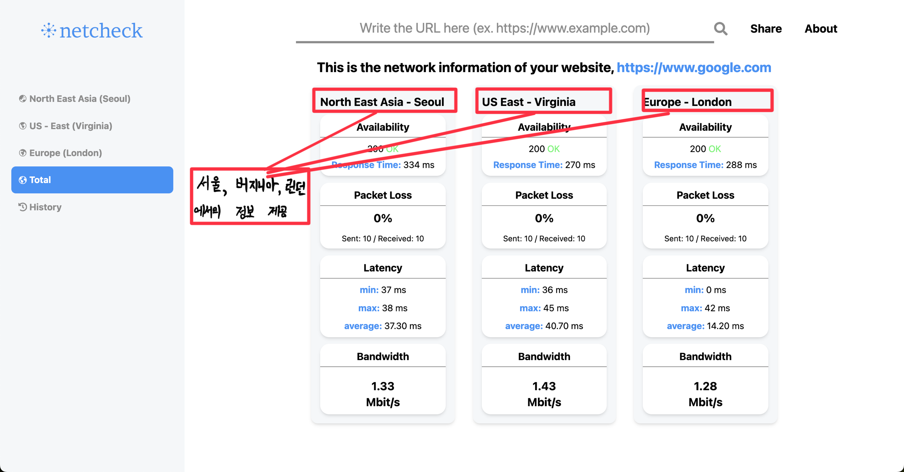

# netcheck

특정 웹사이트에 대한 네트워크 정보를 제공하는 웹 애플리케이션입니다. 사용자가 웹사이트의 URL을 입력하면 해당 웹사이트에 대한 다양한 네트워크 정보를 분석하여 제공합니다.

<a href="https://github.com/minho00123/netcheck-server">netcheck Server</a>

 

# 📌 Table of Contents

- [⚡️ 동기](#️-동기)
- [💡 시연 영상](#-시연-영상)
- [⚒️ 기술 스택](#️-기술-스택)
  - [❓ Why React? (React vs. Next.js)](#-why-react-react-vs-nextjs)
    - [◉ 배경: 사용자에게 더 나은 서비스를 제공할 수 있지 않을까?](#-배경)
    - [◉ 가정: SSR이 CSR보다 렌더링 속도가 빠를 것이다.](#-가정)
    - [◉ 테스트: Next.js vs React](#-테스트)
    - [◉ 결과: SSR과 CSR의 렌더링 속도가 큰 차이를 보이지 않다.](#-결과)
- [🏃‍➡️ 과정](#️-과정)

  - [1. 유저에게 어떤 정보를 제공할 것인가](#1-유저에게-어떤-정보를-제공할-것인가)
    - [1-1. 계획: 네트워크 기본 개념을 공부하자!](#1-1-계획-네크워크-기본-개념을-공부하자)
    - [1-2. 실행: 네트워크 개념을 정리하다.](#1-2-실행-개념을-정리하다)
      - [UDP](#1-2-1-udpuser-datagram-protocol) (※ [TCP vs. UDP](#-tcp-vs-udp))
      - [ICMP](#1-2-2-icmpinternet-control-message-protocol)
      - [패킷](#1-2-3-패킷packet)
      - [TTL](#1-2-4-ttltime-to-live)
      - [라우터](#1-2-5-라우터router)
      - [대역폭](#1-2-6-대역폭bandwidth)
    - [1-3. 결과: "연결이 왜 안될까?"에 대한 정보를 제공하다.](#1-3-결과-연결이-왜-안될까에-대한-정보를-제공하다)
    - [1-4. 발전: 다양한 지리적 위치에서의 네트워크 정보를 제공하다.](#1-4-발전-다양한-지리적-위치에서의-네트워크-정보를-제공하다)

- [🔥 도전](#-도전)
  - [동기: 네트워크 유틸리티를 직접 구현해보자.](#-동기-네트워크-유틸리티를-직접-구현)
  - [문제점: Node.js의 한계 - 저수준 네트워크 정보를 가져올 수 없다!](#-문제점-nodejs의-한계---저수준-네트워크-정보를-가져올-수-없다)
  - [구현 1: traceroute 직접 구현하기.](#-구현-1-traceroute-직접-구현하기)
    - [1-1. 계획: traceroute에 대해 공부하자.](#1-1-계획-traceroute에-대해-공부하자)
    - [1-2. 실행: 일부 라이브러리를 사용하여 traceroute를 구현하다.](#1-2-실행-일부-라이브러리를-사용하여-traceroute-구현)
    - [1-3. 결과: 지리적 위치 정보를 추적하다.](#1-3-결과-지리적-위치-정보를-추적하다)
  - [구현 2: ping 직접 구현하기.](#구현-2-ping-직접-구현하기)
    - [2-1. 계획: ping에 대해 공부하자.](#2-1-계획-ping에-대해-공부하자)
    - [2-2. 실행: ping 구현](#2-2-실행-ping-구현)
    - [2-3. 결과: 패킷 손실율을 계산하다.](#2-3-결과-패킷-손실율을-계산하다)

 

# ⚡️ 동기

현재 우리는 인터넷 없이 살 수 없는 상황이 되었습니다. 언제, 어디서든 인터넷을 이용해 많은 정보를 얻고 있습니다.아침에 일어나 날씨를 확인하고, 궁금한 단어가 있으면 핸드폰을 통해 찾아보고, 또한 실시간으로 영상통화를 진행하기도 합니다. 이러한 인터넷이 어떠한 경로를 통해 우리에게 전달되는지가 저의 가장 큰 궁금증이었습니다. 경로를 알기 위해서는 다양한 네트워크 정보들이 필요했습니다. DNS, 보안, 그리고 연결이 제대로 되었는 지를 알아야 했습니다. 이러한 정보들을 한 곳에서 다른 사람들에게 제공할 수 있으면 좋겠다는 생각을 통해 프로젝트를 진행하였습니다.

# 💡 시연 영상

# ⚒️ 기술 스택

## Frontend

## Backend

## DB

## ❓ Why React? (React vs. Next.js)

### ◉ 배경: 사용자에게 더 나은 서비스를 제공할 수 있지 않을까?

- 사용자에게 보다 나은 경험을 제공하기 위해 server-side와 client-side 렌더링을 비교해보았습니다. Server-side 렌더링(SSR)은 서버에서 미리 HTML 페이지를 그려 브라우저로 보내기 때문에 client-side 렌더링(CSR)보다 더 빠르게 페이지를 렌더링할 수 있습니다. 이를 바탕으로 실제 프로젝트에서 얼마나 차이를 보이는 지 궁금하여 테스트를 진행해보았습니다. 동일한 페이지를 렌더링하는 데 있어서 Next.js로 server-side를, React로는 client-side를 구현하였습니다.

### ◉ 가정: SSR이 CSR보다 렌더링 속도가 빠를 것이다.

- Next.js의 `getServerSideProps` 함수를 사용하여 데이터를 사전에 불러와 렌더링하는 경우, client-side에서 렌더링을 수행하는 React보다 빠를 것이라 가정하였습니다.

### ◉ 테스트: Next.js vs React

- MongoDB Atlas에 데이터를 저장해놓고, 이 데이터를 가져와 실제 프로젝트 환경을 모사하여 테스트를 진행하였습니다.
  

- 렌더링 속도 측정은 개발자 도구의 "Performance" 탭을 통해 이루어졌고, LCP(Largest Contentful Paint)를 기준으로 삼았습니다. 그 이유는 LCP가 끝나면 렌더링이 완료된 것을 확인할 수 있었기 때문입니다.
  - LCP는 가장 큰 콘텐츠(ex. 이미지, 비디오 블록, 텍스트 블록 등)가 렌더링되기까지 걸린 시간을 말합니다.
    

  
  

### ◉ 결과: SSR과 CSR의 렌더링 속도가 큰 차이를 보이지 않다.

- 총 5번의 속도를 측정한 결과는 다음과 같았습니다.

  |         | React   | Next.js |
  | ------- | ------- | ------- |
  | 1       | 791.68  | 704.84  |
  | 2       | 1010    | 844.95  |
  | 3       | 734.77  | 960.70  |
  | 4       | 688.57  | 866.48  |
  | 5       | 866.59  | 975.17  |
  | Average | 813.322 | 870.428 |

- SSR이 CSR보다 초기 렌더링이 빠르다는 일반적인 인식과 달리, 테스트 결과는 큰 차이를 보이지 않았습니다.

🧐 위와 같은 결과가 나온 이유는 무엇일까?

- SSR이 CSR보다 빠른 초기 렌더링을 가진다고 하지만, 왜 비슷한 결과를 보였는지는 다음과 같은 이유라고 생각해보았습니다.

1.  네트워크 및 장비 문제

- 테스트를 진행했던 당시의 네트워크 환경이 좋지 않거나, 테스트한 노트북 성능에 따라 속도가 달라질 수 있습니다.

2.  전송되는 데이터 크기

- SSR은 초기 로드 시에 전체 페이지에 콘텐츠를 모두 전송하지만, CSR은 필요한 데이터만을 로드하기 때문에 이러한 결과가 나올 수 있습니다.
   
   
  ∴ 리렌더링되는 경우에는 SSR이 빠를 수 있지만 프로젝트에서는 초기 렌더링 속도가 중요하다고 생각하기 때문에 React를 사용하는게 더 좋다는 결론을 내렸습니다.

 

# 🏃‍➡️ 과정

## 1. 유저에게 어떤 정보를 제공할 것인가?

### 1-1. 계획: 네크워크 기본 개념을 공부하자.

- 유저에게 필요한 정보를 제공하기 위해서는 우선 저의 네트워크 지식을 향상시켜야 했습니다. 공부를 진행하면서 무엇이 필요한 내용일지를 곰곰히 생각해보았습니다.

### 1-2. 실행: 개념을 정리하다.

- 네트워크 기본 개념들을 다음과 같이 정리하였습니다:

#### 1-2-1. UDP(User Datagram Protocol)

- UDP는 보안과 신뢰성보다 전송 속도와 효율성이 더 중요한 경우 데이터를 전송하기 위해 IP와 함께 오래 사용된 프로토콜이다.
  - 특히 비디오 재생 또는 DNS 조회와 같이 시간에 민감한 전송을 위해 인터넷을 통해 사용된다.
  - 데이터가 전송되기 전에는 공식적으로 연결이 설정되지 않으므로 통신 속도가 빨라진다. 따라서 데이터를 아주 빠르게 전송할 수 있지만, 전송 중에 패킷이 손실되어 DDoS 공격의 형태로 악용될 수 있다.
- UDP에는 handshaking 대화 수단이 없어, 전달, 순서 또는 중복에 관한 보호가 보장되지 않는다. 따라서 빠르게 데이터를 전송할 수 있다.
  - 하지만 이 속도 때문에 성능 저하가 생긴다. UDP 데이터그램이 전송 중에 손실되면 다시 전송되지 않는다. 따라서 UDP를 사용하는 애플리케이션은 오류, 손실, 중복을 허용할 수 있어야 한다.
- UDP는 오류 확인 및 수정이 필요하지 않거나 애플리케이션에서 수행되는 목적에 적합하다. 특히 시간에 민감한 애플리케이션은 UDP를 사용하는 경우가 많다.

  - 실시간 시스템(ex, 온라인 게임)에서 이상적인 프로토콜이다. 실시간 시스템에서 UDP는 옵션이 아닐 수 있는 재전송으로 인해 지연된 패킷을 기다리는 것보다, 패킷 삭제가 더 바람직하기 때문이다.
  - DNS 서버는 빠르고 효율적이기도 해야 하므로 UDP를 통해서도 작동한다.

##### ※ TCP vs. UDP

- TCP는 안정적인 데이터 전달을 보장하는 전송 계층 프로토콜이다.
- TCP를 연결하는 것은 다른 회사 사무실에 있는 누군가에게 전화를 거는 것과 비슷하다. 먼저 회사의 전화번호를 누른다. 이렇게 하면 그 회사로 연결된다. 그 다음에엔 전화를 걸고자 하는 상대방이 쓰는 번호를 누른다.
- TCP 커넥션이 맺어지면 클라이언트와 서버 컴퓨터 간에 주고받는 메시지들은 손실 혹은 손상되거나 순서가 바뀌지 않고 안전하게 전달된다.
- TCP는 다음을 제공한다.
  - 오류 없는 데이터 전송
  - 순서에 맞는 전달 (데이터는 언제나 보낸 순서대로 도착한다)
  - 조각나지 않는 데이터 스트림 (언제든 어떤 크기로든 보낼 수 있다)
- TCP는 handshake를 통해 연결을 설정한다. 이 handshake가 완료된 후에만 실제로 데이터 패킷이 한 컴퓨터에서 다른 컴퓨터로 전송된다.
- TCP는 데이터 패킷이 수신되어야 하는 순서를 나타내고 패킷이 의도한 대로 도착하는지 확인한다. 패킷이 도착하지 않는 경우 TCP를 다시 보내야 한다.
  - UDP에는 이러한 기능이 없다. 따라서 UDP는 handshake가 필요없고, 데이터가 제대로 도착하는지 확인하지 않기 떄문에 TCP보다 훨씬 빠르게 데이터를 전송할 수 있다.
- UDP는 TCP보다 빠르지만, 안정성이 떨어진다.

- 참고: [MDN](https://developer.mozilla.org/ko/docs/Glossary/UDP), [Cloudflare](https://www.cloudflare.com/ko-kr/learning/ddos/glossary/user-datagram-protocol-udp/)

#### 1-2-2. ICMP(Internet Control Message Protocol)

- ICMP는 네트워크 장치에서 네트워크 통신 문제를 진단하는 데 사용하는 네트워크 계층 프로토콜이다.
  - ICMP는 주로 데이터가 의도한 대상에 적시에 도달하는지 여부를 확인하는 데 사용된다.
  - Ex. 메시지가 너무 길거나 데이터 패킷이 순서에 맞지 않게 도착하여 수신자가 메시지를 조합하지 못할 수 있다. 이러한 경우 수신자는 ICMP를 사용하여 발신자에게 오류 메시지를 알리고 메시지 재전송을 요청한다.
- 일반적으로 ICMP는 라우터와 같은 네트워크 장치에서 사용된다.
- ICMP는 오류 보고 및 테스트에 아주 중요하지만, DDoS 공격에도 사용될 수 있다.
- ICMP의 주요 목적은 오류 보고다.
  - 두 장치가 인터넷을 통해 연결되면 ICMP는 데이터가 의도한 대상에 도달하지 못한 경우 전송하는 장치와 공유할 오류를 생성한다.
  - Ex. 데이터 패킷이 라우터에 비해 너무 큰 경우 라우터에서는 패킷을 삭제하고 ICMP 메시지를 데이터의 원래 소스로 돌려보내다.
- ICMP의 보조 용도는 네트워크 진단을 수행하는 것이다.
  - 일반적으로 사용되는 터미널 유틸리티 `traceroute` 와 `ping`은 모두 ICMP를 사용하여 작동한다.
- ICMP은 TCP 또는 UDP와 같은 전송 계층 프로토콜과 연결되지 않는다. 따라서 ICMP가 연결이 없는 프로토콜이 되므로 한 장치에서 ICMP 메시지를 보내기 전에 다른 장치와의 연결을 수행할 필요가 없다.
- ICMP는 일반적으로 TCP/IP 또는 UDP 같은 다른 네트워크 프로토콜과 함께 작동한다.
- 호스트와 라우터는 특정 네트워크 이벤트가 발생할 때 ICMP 메시지 또는 ICMP 패킷을 교환한다.

- 참고: [Cloudflare](https://www.cloudflare.com/ko-kr/learning/ddos/glossary/internet-control-message-protocol-icmp/), [AWS](https://aws.amazon.com/ko/what-is/icmp/)

#### 1-2-3. 패킷(packet)

- 패킷은 네트워크를 통해 전송되는 데이터의 단위이다. 네트워크에서 데이터를 전송할 때, 데이터는 여러 개의 작은 조각, 즉 패킷으로 나누어진다. 각 패킷에는 데이터의 일부분과 함께 해당 데이터가 올바르게 전송되고 재조립될 수 있도록 돕는 제어 정보가 포함되어 있다.

#### 1-2-4. TTL(Time-to-Live)

- TTL은 패킷이 네트워크 상에서 살아있을 수 있는 최대 홉(hop) 수를 지정한다.
- 홉이란 한 라우터와 다른 라우터 간의 여정을 말한다.
- 각 홉에서 라우터는 패킷의 TTL 값을 1 감소시킨다. TTL 값이 0이 되면 라우터는 더 이상 패킷을 전달하지 않고, "Time Exceeded" 메시지를 송신자에게 보내고 패킷을 페기한다.

#### 1-2-5. 라우터(Router)

- 라우터는 네트워크에서 데이터 패킷을 전송하는 장치로, 다른 네트워크 간에 정보를 전달하는 역할을 한다.
- 라우터는 데이터 패킷이 출발지에서 목적지까지 가장 효율적인 경로를 찾아 이동할 수 있도록 돕는다.

#### 1-2-6. 대역폭(Bandwidth)

- 네트워크에서의 대역폭은 컴퓨터 네트워크나 인터넷 연결을 통해 한 지점에서 다른 지점으로 최대 데이터 양을 전송하는 용량이다.
- 데이터 연결의 대역폭이 클수록 한 번에 주고 받을 수 있는 데이터도 많아진다.
- 속도는 데이터가 전송될 수 있는 속도를 말하는 반면, 대역폭의 정의는 그 속도에 대한 용량이다.
  - 물을 예를 들어 설명하면 속도는 물이 얼마나 빨리 파이프를 통과하는지, 대역폭은 파이프의 직경을 의미한다.

### 1-3. 결과: "연결이 왜 안될까?"에 대한 정보를 제공하다.

- 공부하는 과정에서 사용자가 가장 필요로하는 정보는 네트워크 연결 여부라고 생각했습니다. 만약 특정 URL이 제대로 동작하지 않으면 왜 연결이 안되는 지를 가장 궁금해할 것입니다. 이 궁금증을 충족시키기 위해 연결 시간, 패킷의 손실 여부, 지연율, 대역폭의 정보를 제공하였습니다.
- 부가적으로는 사용자가 만든 웹사이트의 네트워크 정보를 확인하고 싶을 때의 상황을 생각하였습니다. 도메인이 등록된 회사 정보와 만료일, IP 주소와 지리적 위치, SSL, CSP, HSTS와 같은 보안 관련 정보 등록 여부, 그리고 웹사이트가 어떤 경로로 클라이언트에서 서버로 전송되는 지를 지도로 나타내었습니다.

### 1-4. 발전: 다양한 지리적 위치에서의 네트워크 정보를 제공하다.

- 모든 정보를 제공한 후에 추가적인 아이디어를 생각하게 되었습니다. 현재 위치 뿐만 아니라 다양한 대륙에서 해당 URL로의 네트워크 정보는 어떻게 달라지는 지 정보를 제공하고 싶었습니다. 이러한 결과를 제공하기 위해서는 AWS를 이용하여 다양한 도시(대한민국 서울, 미국 버지니아, 영국 런던)에서 서버를 각각 만든 후에 연결시켰습니다. 결과적으로 이 세 도시의 정보를 한 번에 확인할 수 있는 웹페이지를 제공하게 되었습니다.

# 🔥 도전

## ◉ 동기: 네트워크 유틸리티를 직접 구현?!?

- 네트워크 유틸리티를 사용하여 패킷 손실, 그리고 지리적 위치 정보를 가져오던 중에 실제로 이 유틸리티를 구현해보면 네트워크의 개념과 원리를 더 깊이 알 수 있을 것이라 생각하였습니다. 따라서 두 인터넷 연결 간의 경로를 알기 위해 사용했던 `traceroute`와 네트워크 연결 상태와 속도 정보를 가져오기 위한 `ping` 유틸리티를 직접 구현해보기로 하였습니다.

## ◉ 문제점: Node.js의 한계 - 저수준 네트워크 정보를 가져올 수 없다!

- `traceroute`와 `ping`을 라이브러리 없이 구현해보려고 노력하였지만 예상치 못한 한계점을 맞이하였습니다. 이미 구현된 라이브러리를 참고하던 중에 C++을 이용한 코드들이 보였습니다. 왜 JavaScript를 사용하지 않고 다른 프로그래밍 언어를 사용하였는 지 찾아본 결과, JavaScript로는 저수준의 네트워크 정보를 가져올 수 없다는 것을 알게 되었습니다. 이에 대한 한계점 때문에 일부 라이브러리를 사용하게 되었습니다. UDP 데이터 그램 소켓을 통해 네트워크 통신을 수행할 수 있게 해주는 모듈인 `dgram`과 ICMP를 전달 받기 위해서 `raw-socket` 라이브러리를 사용하였습니다.

## ◉ 구현 1: `traceroute` 직접 구현하기

### 1-1. 계획: `traceroute`에 대해 공부하자.

- `traceroute`는 두 인터넷 장치 간의 라우팅 경로를 표시하는 데 사용하는 컴퓨터 네트워크 진단 유틸리티 입니다. 이를 직접 구현하기 위해서는 작동원리에 대해 자세히 공부하였습니다. 작동원리는 다음과 같습니다:

  - `traceroute`는 첫 번째 패킷의 TTL을 1로 설정하고 목적지 주소로 UDP를 보냅니다. 이 패킷은 첫 번째 라우터에서 폐기되고, 해당 라우터는 ICMP를 이용하여 송신자에게 "Time Exceeded" 메시지를 보냅니다.
  - 송신자는 이 메시지를 받고 첫 번째 라우터의 주소를 기록합니다.
  - 다음 패킷은 TTL을 2로 설정하여 보냅니다. 이 패킷은 두 번째 라우터에서 폐기되고, 두 번째 라우터의 주소를 기록합니다.
  - 이 과정을 목적지에 도달하거나 설정된 최대 홉 수에 도달할 때까지 반복합니다
  - 각 단계에서 패킷의 왕복 시간을 측정하여 각 라우터까지의 지연 시간을 추정할 수 있습니다.

### 1-2. 실행: 일부 라이브러리를 사용하여 `traceroute` 구현

- 위에서 설명한 `traceroute` 작동 원리를 기반으로 `traceroute`를 직접 구현해보았습니다.
  - 우선 UDP 데이터그램을 사용자가 입력한 주소로 보내기 위해 Node.js의 내장 모듈인 `dgram`을 이용하여 생성하였습니다.
    - `dgram` 모듈은 UDP 데이터그램 소켓을 통해 네트워크 통신을 수행할 수 있게 하는 내장 모듈입니다. 따라서 UDP 서버를 생성하고, UDP 클라이언트를 통해 메시지를 보내고 받을 수 있습니다.
  - ICMP를 전달 받기 위해서 `raw-socket`이라는 외부 라이브러리를 사용하였습니다. 이 라이브러리는 Node.js에서 raw socket을 사용할 수 있게 해줍니다. Raw socket을 사용하면, 애플리케이션은 네트워크 레이어에서 직접 패킷을 보내고 받을 수 있습니다.
  - 원리에서 처럼 TTL 수를 하나씩 늘려가면서 라우터에 대한 주소를 받아올 수 있었습니다. 그리고 무한히 TTL 수를 늘릴 수 없기 때문에 일반적으로 사용되는 최대 수인 20을 지정하였습니다.

### 1-3. 결과: 지리적 위치 정보를 추적하다.

- `traceroute`를 직접 구현하여 사용자가 작성한 URL까지의 지리적 위치 정보를 추적할 수 있었습니다.

## 구현 2: `ping` 직접 구현하기

### 2-1. 계획: `ping`에 대해 공부하자.

- `ping`은 네트워크 연결 상태와 속도를 진단하는 도구입니다. 주로 네트워크 문제를 진단하고, 특정 호스트가 네트워크 상에서 활성 상태인지 확인하는 데 사용됩니다. `ping`의 작동 원리는 다음과 같습니다:

  - `ping`은 ICMP(Internet Control Message Protocol)를 사용하여 네트워크 통신을 수행합니다. ICMP 에코 요청 메시지를 대상 호스트로 전송하고, 대상 호스트가 에코 응답 메시지를 반환합니다. 이러한 요청과 응답 메커니즘을 통해 네트워크의 연결 상태와 지연 시간을 측정할 수 있습니다.

### 2-2. 실행: `ping` 구현

- `ping`을 구현하기 위해서는 ICMP를 직접 생성하고 보내야 했습니다. 이를 위해서 `raw-socket` 라이브러리를 사용하였습니다.

  - ICMP 에코 요청을 위한 패킷을 생성하기 위해서는 ICMP 헤더 버퍼를 만들어야 했습니다.
  - ICMP 헤더는 ICMP 메시지를 구성하는 중요한 부분으로, 메시지의 유형, 코드, 체크섬, 기타 필요한 정보를 포함합니다.
  - ICMP 헤더는 일반적으로 다음과 같은 구성 요소를 포함합니다:

    1. 유형(Type): 8비트 필드로, ICMP 메시지의 유형을 나타냅니다. 예를 들어, 에코 요청은 8, 에코 응답은 0의 값을 가집니다.
    2. 코드(Code): 8비트 필드로, 메시지 유형 내에서 더 세부적인 구분을 제공합니다. 대부분의 경우, 특히 에코 요청과 응답에서는 이 필드의 값이 0입니다.
    3. 체크섬(Checksum): 16비트 필드로, 헤더와 데이터의 오류 검출을 위한 값입니다. 수신자는 이 값을 사용하여 패킷의 무결성을 검증합니다. 체크섬은 송신자가 메시지를 전송하기 전에 계산되며, 수신자는 수신한 메시지의 체크섬을 다시 계산하여 두 값이 일치하는 지 확인합니다.
    4. 식별자(Identifier): 16비트 필드로, 보통 에코 요청을 보낸 프로세스의 ID를 식별하는 데 사용됩니다. 이 값은 에코 응답을 받았을 때 요청을 보낸 원래 프로세스를 식별하는 데 사용됩니다.
    5. 시퀀스 번호(Sequence Number): 16비트 필드로, 동일한 식별자를 가진 여러 ICMP 메시지를 구분하기 위해 사용됩니다. 이 번호는 에코 요청을 보낼 때 마다 증가하며, 응답에서는 요청에서 받은 그대로의 값을 사용합니다.

  - `raw-socket` 라이브러리를 이용하여 ICMP 프로토콜을 사용하는 소켓을 생성합니다.
  - 각 요청에 대한 송신 시간을 기록하고, 응답 대기에 사용될 타임아웃 핸들러를 관리합니다.
  - 주어진 횟수만큼 ping 요청을 반복하며, 각 요청에 대해 에코 응답을 기다립니다.
  - 에코 응답이 도착하면 송신 시간과 수신 시간의 차이를 계산하여 지연 시간을 측정합니다.
  - 모든 요청이 완료되면, 송신 횟수, 수신 횟수, 패킷 손실률, 각 요청의 지연 시간 배열을 포함하는 객체를 반환합니다.

### 2-3. 결과: 패킷 손실율을 계산하다.

- `ping`을 직접 구현한 결과를 바탕으로 패킷 손실율을 계산하여 사용자에게 제공할 수 있었습니다.

